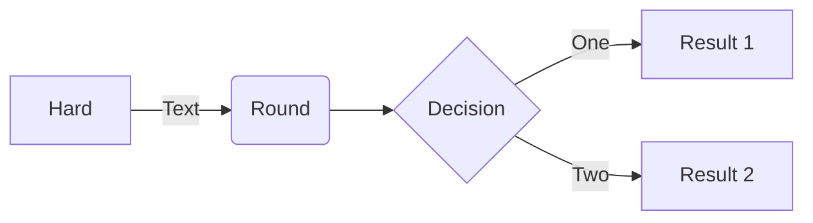
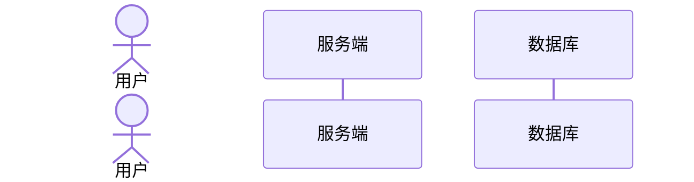
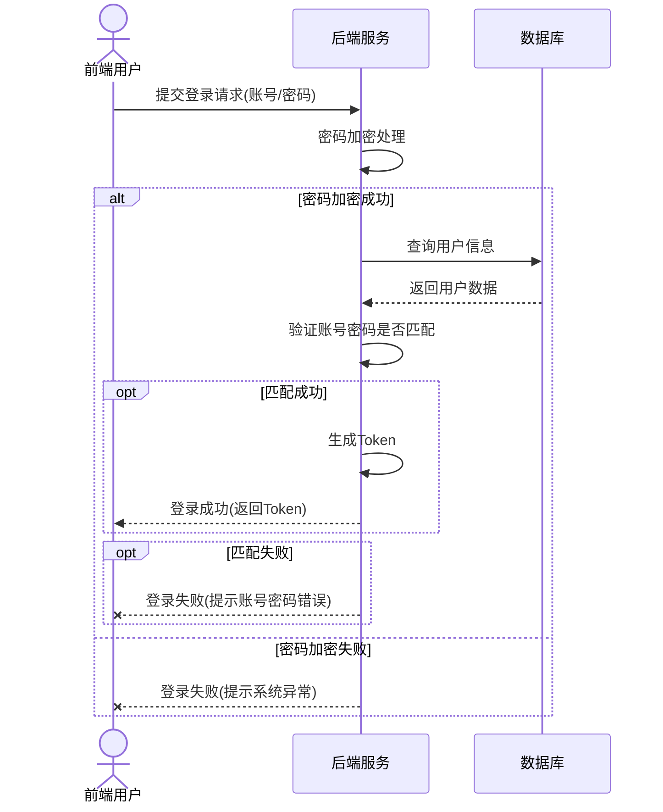
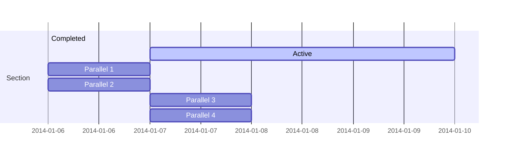
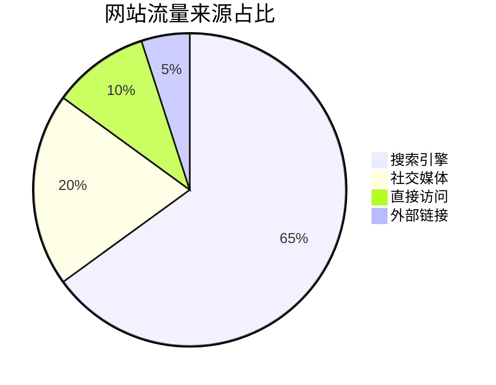
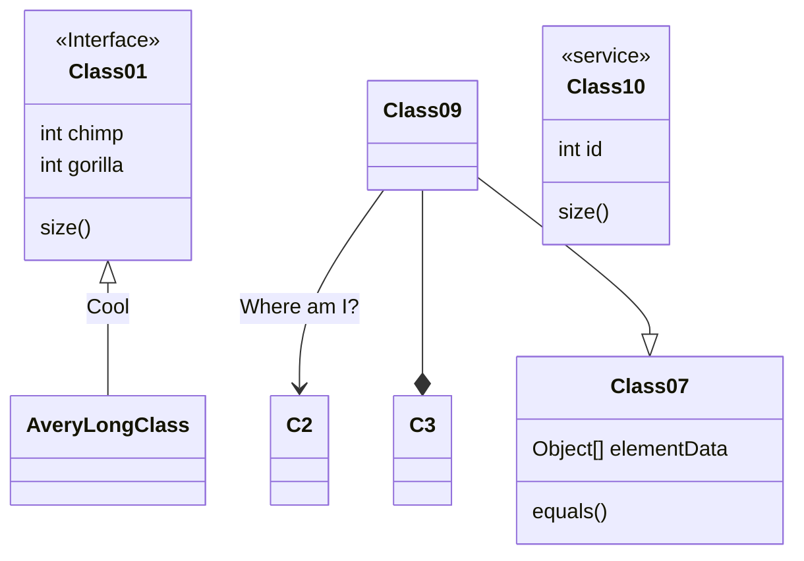
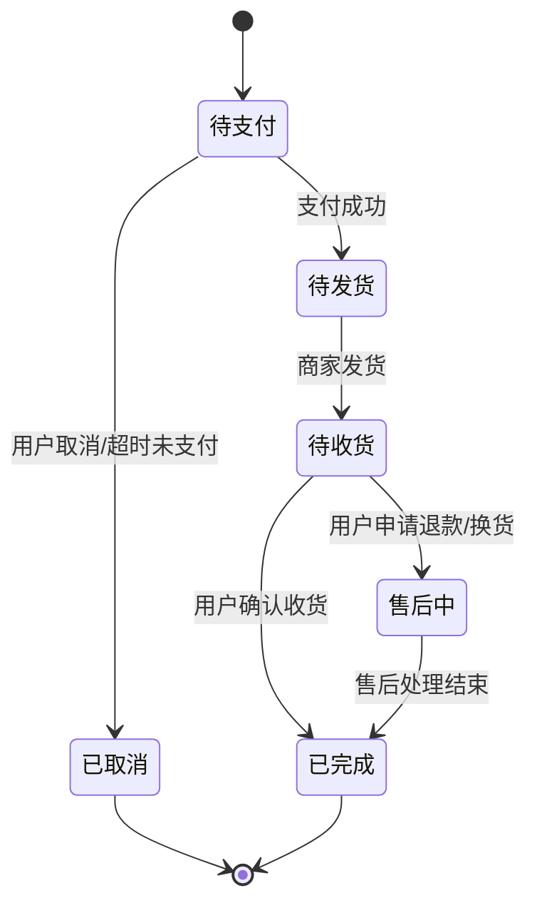

- 目录
{:toc}

---

Mermaid 是一款基于 JavaScript 的图表绘制工具，通过简单的文本描述即可生成流程图、时序图、甘特图等多种图表。以下整理了最常用的几种图表的核心语法。

## 一、流程图（Flowchart）
最常用的图表类型，用于描述业务流程、执行逻辑，支持多方向布局和复杂子图/分支。

### 1. 基础规则
- 图表开头用`flowchart`（旧版`graph`也兼容），后跟布局方向，无方向默认从上到下；
- 节点用唯一标识定义，标识与显示文本用`[]/()/{}/(())`分隔，对应不同节点样式；
- 连线用箭头/符号表示，可添加连线说明文本；
- 子图用`subgraph`定义，用于分组逻辑，子图可独立指定方向。

### 2. 核心元素
#### （1）布局方向

| 语法  | 含义                                    |
| ----- | --------------------------------------- |
| TD/TB | 从上到下（Top Down/Top Bottom，最常用） |
| LR    | 从左到右（Left Right）                  |
| BT    | 从下到上（Bottom Top）                  |
| RL    | 从右到左（Right Left）                  |

#### （2）节点样式

| 语法       | 节点类型                     | 示例                  |
| ---------- | ---------------------------- | --------------------- |
| id[文本]   | 矩形（普通流程节点，最常用） | start[开始]           |
| id(文本)   | 圆角矩形（开始/结束节点）    | end(结束)             |
| id{文本}   | 菱形（判断/分支节点）        | judge{是否符合条件？} |
| id((文本)) | 圆形（起止/重要节点）        | core((核心步骤))      |
| id>文本    | 右向旗帜形                   | flag>备注             |

#### （3）连线类型

| 语法       | 连线样式                             | 示例（带说明）      |
| ---------- | ------------------------------------ | ------------------- |
| ->         | 实线箭头（最常用）                   | A->B                |
| -->        | 虚线箭头                             | A-->B               |
| -.-        | 点线箭头                             | A-.-B               |
| ==>        | 粗线箭头                             | A==>B               |
| ->\|文本\| | 实线箭头+说明                        | A->\| 执行操作 \| B |
| ~~~        | 隐藏线，用于控制布局，不展示实际连线 | A~~~B               |

### 3. 完整示例



## 二、时序图（Sequence Diagram）

用于描述不同参与者之间的交互过程，按时间顺序展示消息传递，适合接口调用、系统交互等场景。

### 1. 基础规则
- 图表开头用`sequenceDiagram`，无需指定方向，默认从左到右、从上到下按时间流；
- 先定义参与者（Actor/Participant），参与者可自定义别名；
- 消息连线按交互关系选择，可添加消息文本，支持循环、条件、并行等逻辑块。

### 2. 核心元素
#### （1）参与者定义



- actor：带人形图标的参与者（如用户、管理员）；
- participant：普通矩形参与者（如系统、服务、数据库）；
- as：为参与者设置别名，简化后续语法。

#### （2）消息连线（核心）

| 语法            | 连线含义                 | 适用场景            |
| --------------- |
| A->B: 文本      | 实线无箭头，单向消息     | 普通通知 / 调用     |
| A->>B: 文本     | 实线有箭头，单向同步调用 | 核心交互（最常用）  |
| A-->>B: 文本    | 虚线有箭头，单向异步调用 | 异步接口 / 消息队列 |
| A--x B: 文本    | 虚线叉号，调用失败       | 异常反馈            |
| A->B\B->A: 文本 | 双向箭头，互相交互       | 双向通信            |

#### （3）逻辑块

| 语法     | 逻辑块类型         | 示例（带说明）                                  |
| -------- | ------------------ | ----------------------------------------------- |
| loop     | 循环块             | loop 重复执行 { 操作 }                          |
| alt/else | 条件分支（二选一） | alt 条件1 { 操作1 } else { 操作2 }              |
| alt      | 条件块             | alt 条件1 { 操作1 } alt 条件2 { 操作2 }         |
| par      | 并行块             | par 并行操作1 { 操作1 } and 并行操作2 { 操作2 } |

### 3. 完整示例


## 三、甘特图（Gantt Chart）
用于项目进度管理，按时间维度展示任务的开始 / 结束时间、持续时长、任务归属和完成状态，适合项目排期、里程碑规划。

### 1. 基础规则
- 图表开头用`gantt`，无需指定方向，默认从左到右、从上到下按时间流；
- 先定义任务（Task），任务可自定义名称、开始时间、持续时长、任务归属和完成状态；
- 必选日期格式（dateFormat）和标题（title）；
- 用section划分任务模块（如需求、开发、测试）；
- 任务连线按任务依赖关系选择，可添加任务描述，支持循环、条件、并行等逻辑块。

### 2. 核心元素

#### （1）日期格式（常用）

| 语法       | 格式说明               | 示例       |
| ---------- | ---------------------- | ---------- |
| YYYY-MM-DD | 年 - 月 - 日（最常用） | 2025-01-01 |
| MM-DD      | 月 - 日（默认当年）    | 01-01      |
| HH:mm      | 时：分（默认当天）     | 09:00      |


#### （2）任务定义格式

```
任务名 : 标识, 开始时间, 结束时间
# 或（按持续时长）
任务名 : 标识, 开始时间, +持续时间（d=天，h=小时，m=分钟）
```
- 标识：可选，用于任务关联，可省略；
- 特殊标记：done（已完成任务）、crit（关键任务）。

### 3. 完整示例



## 四、饼图（Pie Chart）
用于展示数据占比，语法极简，适合快速呈现分类数据的比例关系。

### 1. 基础规则
- 图表开头用`pie`；
- 必选标题（title）；
- 数据行格式："分类名" : 数值（数值支持整数 / 浮点数，会自动计算占比）。

### 2. 完整示例



## 五、类图（Class Diagram）
用于面向对象设计，描述类、接口、对象之间的关系（继承、关联、聚合等），适合架构设计、代码建模。

### 1. 基础规则
- 图表开头用`classDiagram`；
- 类的定义：class 类名 { 属性; 方法 }，支持访问修饰符（公有 / 私有 / 受保护）；
- 用符号表示类之间的关系，箭头指向被关联 / 继承的类。

### 2. 核心元素

#### （1）访问修饰符

| 语法 | 含义                   |
| ---- | ---------------------- |
| +    | 公有（public，最常用） |
| -    | 私有（private）        |
| #    | 受保护（protected）    |

#### （2）类间关系（核心）

| 语法 | 关系含义     | 适用场景                       | 示例           |
| ---- | ------------ | ------------------------------ | -------------- |
| ---> | 继承（泛化） | 子类 --> 父类                  |                |
| -->  | 关联         | 类之间的普通依赖               | 学生 --> 课程  |
| *--  | 聚合         | 整体包含部分，部分可独立存在   | 班级 *-- 学生  |
| o--  | 组合         | 整体包含部分，部分不可独立存在 | 人 o-- 心脏    |
| ..>  | 实现         | 类实现接口                     | 实现类..> 接口 |

### 3. 完整示例



## 六、状态图（State Diagram）
用于描述对象的状态变化过程，展示状态之间的转换条件和触发事件，适合生命周期、状态机设计（如订单状态、设备状态）。

### 1. 基础规则
- 图表开头用stateDiagram（或stateDiagram-v2，新版更友好）；
- 用[*]表示初始状态 / 结束状态；
- 状态之间用--> 连接，可添加触发条件 / 事件。

### 2. 完整示例


## 七、Mermaid 通用使用技巧

1. 代码块包裹：所有语法必须写在mermaid和 ``` 之间，平台才会渲染；
2. 注释：用%%添加注释，注释内容不会渲染；
3. 空格 / 换行：语法对空格、换行不敏感，可合理换行让代码更易读；
4. 别名 / 唯一标识：节点、参与者的标识必须唯一，建议用简单英文 / 拼音，避免中文；
3. 布局控制：流程图中子图可通过subgraph 子图名 [方向]指定独立方向；调整子图位置可通过「定义顺序 + 隐形连接（-.->/---）」引导排版；



