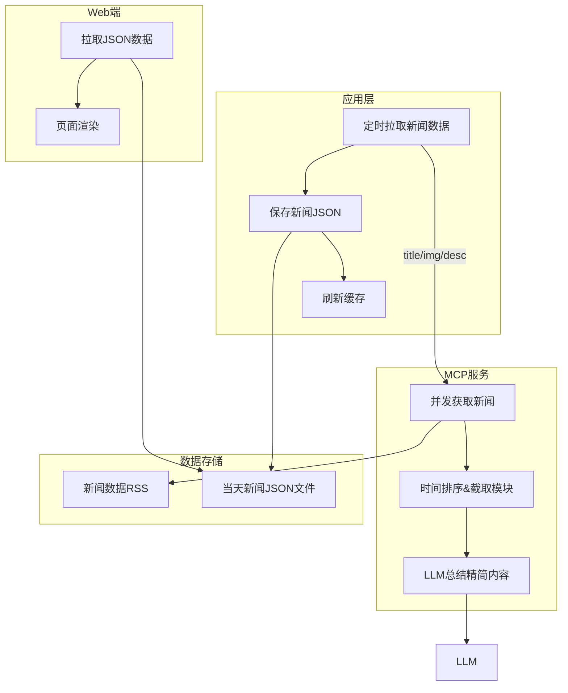

- 目录
{:toc}

---

<div class="text-center my-5">
    <a href="https://geek.cyeam.com/geek" class="btn btn-primary btn-lg py-3 px-5">
        <i class="bi bi-download me-2"></i>
        立即体验-GeekNews
    </a>
</div>

# 需求
1. 新增微信公众号RSS，微信防爬虫力度非常强，需要做适配。只展示标题、链接即可；
2. 其他RSS支持标题、链接、内容简介（基于AI总结）;
3. 基于MCP搭建，每天定时更新AI最新动态。

# 方案



# MCP 实现

## 传输方式对比

| 对比维度     | stdio（标准输入输出）                                                                                             | Streamable HTTP（新版官方推荐）                                                                                | HTTP with SSE（旧版已弃用）                                                                             |
| ------------ | ----------------------------------------------------------------------------------------------------------------- | -------------------------------------------------------------------------------------------------------------- | ------------------------------------------------------------------------------------------------------- |
| 核心通信机制 | 客户端启动服务器子进程，通过 stdin/stdout 双向传输换行分隔的 JSON-RPC 消息，stderr 用于日志Model Context Protocol | 单一 HTTP 端点同时支持 POST/GET；客户端 POST 发请求，支持同步 JSON 响应或 SSE 流式推送，内置会话管理与断点续传 | 双端点架构：SSE GET 端点建立长连接收服务端消息，HTTP POST 端点发客户端消息，服务端通过 SSE 单向推送结果 |
| 部署模式     | 本地父子进程，仅限同一台机器                                                                                      | 独立服务进程，支持本地 / 局域网 / 云端跨网络跨机器部署                                                         | 独立服务进程，支持跨网络跨机器部署                                                                      |
| 生命周期     | 与客户端进程强绑定，客户端退出则服务器子进程终止                                                                  | 服务端独立运行，与客户端完全解耦，支持会话生命周期管理                                                         | 服务端独立运行，与客户端解耦                                                                            |
| 多客户端能力 | 不支持，1 个客户端对应 1 个独立服务器进程                                                                         | 原生支持多客户端并发连接，可负载均衡                                                                           | 支持多客户端连接                                                                                        |
| 连接恢复能力 | 进程退出即连接终止，无恢复能力                                                                                    | 原生支持 SSE 流断点续传，通过 Last-Event-ID 重放丢失消息Model Context Protocol                                 | 断连后需重建 SSE 连接，无官方续传机制                                                                   |
| 性能表现     | 本地进程间通信，延迟极低（通常 < 1ms），无网络栈开销，资源占用最小                                                | 受网络带宽 / 延迟影响，长连接模式下延迟可控，支持流式传输优化                                                  | 受网络影响，长连接占用固定资源，断连开销大                                                              |
| 安全性       | 天然安全，不暴露网络端口，无远程攻击面，依赖操作系统进程隔离                                                      | 需自行配置 HTTPS 加密、Origin 校验、身份认证、防火墙策略，有网络暴露风险Model Context Protocol                 | 同左，需额外的安全加固                                                                                  |

## MCP 切换官方Go SDK

```Go
// 服务端
server1 := mcp.NewServer(&mcp.Implementation{Name: "greeter1"}, nil)
mcp.AddTool(server1, &mcp.Tool{Name: "greet1", Description: "say hi"}, SayHi)
handler := mcp.NewStreamableHTTPHandler(func(request *http.Request) *mcp.Server {
    return server1
}, nil)
app.Handle("/mcp", http.HandlerFunc(handler.ServeHTTP))
l, err := net.Listen("tcp", ":1031")
if err != nil {
    logger.Errorf("Listen: %v", err)
    return
}
app.Serve(l)

// 客户端
client := mcp.NewClient(&mcp.Implementation{Name: "mcp-client", Version: "v1.0.0"}, nil)
ctx := context.Background()
transport := &mcp.StreamableClientTransport{Endpoint: "http://localhost:1031/mcp"}
session, err := client.Connect(ctx, transport, nil)
if err != nil {
    log.Fatal(err)
}
defer session.Close()

params := &mcp.CallToolParams{
    Name:      "greet1",
    Arguments: map[string]any{"name": "you"},
}
res, err := session.CallTool(ctx, params)
if err != nil {
    log.Fatalf("CallTool failed: %v", err)
}
for _, a := range res.Content {
    buf, _ := a.MarshalJSON()
    fmt.Println(string(buf))
}
```


