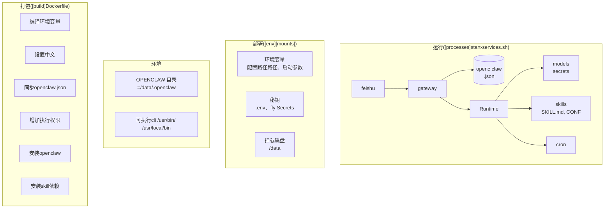

- 目录
{:toc}

---

# Quick Start

- 下载OpenClaw脚手架[cyeamclaw](https://github.com/cyeam/cyeamclaw)。
- 申请fly应用和外挂存储，参考官方文档[fly.io](https://docs.openclaw.ai/install/fly).
- 在fly.io或.env中部署密钥，使用`fly deploy`命令部署。

# 部署流程



在fly.io部署最核心的是fly.toml文件，它定义了应用的编译信息`[build]`、环境变量`[env]`、硬盘挂载`[mounts]`、启动配置`[processes]`等。

1. [build]用Dockerfile文件实现，构建包含 OpenClaw 全量运行依赖的 Docker 镜像，本阶段最终产出：可直接部署的 OpenClaw 标准化 Docker 镜像。：
   1. 配置编译环境变量：在 Dockerfile 中预设构建所需的基础环境参数，比如 Node.js 运行时版本、软件源、系统架构适配参数等，确保跨环境构建的一致性。
   2. 设置系统中文环境：安装中文字体、配置zh_CN.UTF-8系统编码，解决 OpenClaw 运行时的中文乱码、 emoji 显示异常问题。
   3. 同步 openclaw.json 主配置文件：将提前编写好的 OpenClaw 核心配置文件打包到镜像内，或预设配置模板，确保服务启动时可直接加载核心规则。
   4. 增加执行权限：给启动脚本start-services.sh、技能执行脚本等核心文件授予可执行权限，避免容器启动时因权限不足报错。
   5. 安装 OpenClaw 主程序：通过 npm 全局安装 OpenClaw CLI，将可执行文件部署到/usr/bin/、/usr/local/bin/系统路径（对应图表「环境」模块的可执行 CLI 路径），确保全局可调用。
   6. 安装 Skill 技能依赖：提前安装自定义技能所需的系统依赖、语言运行时依赖，避免运行时技能加载失败。
2. [env]定义环境变量，磁盘挂载。OpenClaw运行时信息，包括记忆、日志不能放在容器中，否则会在每次部署时被覆盖，需要放在挂载硬盘`/data`上。
   1. 持久化工作目录准备：确定 OpenClaw 核心工作目录为/data/.openclaw，该目录用于存储会话数据、技能文件、运行日志、模型密钥等核心数据，需提前准备对应的持久化存储资源。
   2. 执行需要的cli放在`/usr/bin`，`/usr/local/bin`，确保全局可调用。
   3. 环境变量注入：通过容器环境变量，配置 OpenClaw 的核心运行参数，主要是OpenClaw和Skill的配置文件路径、模型并发限制等。
```
OPENCLAW_STATE_DIR=/data
OPENCLAW_HOME /data/.openclaw
OPENCLAW_CONFIG_PATH=/data/config
OPENCLAW_HOME /data/.openclaw
```
   4. 敏感密钥安全管理：通过.env文件、fly Secrets 等安全方式，注入模型 API 密钥、飞书渠道凭证、第三方服务 Token 等敏感信息，避免硬编码到镜像中造成泄露。
1. [processes]从start-services.sh作为入口启动服务，核心是openclaw.json配置文件。
   1. 默认日志在/tmp/openclaw.log。
   2. openclaw工作目录功能如下，workspace里的文件调教方式可参考[《搞懂这7个配置文件让你的OpenClaw变智能助手》](https://developer.aliyun.com/article/1715278)：

```
/data/.openclaw/
├── openclaw.json                 # 主配置文件（JSON/JSON5）
├── workspace/                    # 你的 AI “灵魂”文件夹（推荐 git 版本控制）
│   ├── SOUL.md                   # 人格设定（语气、风格）
│   ├── USER.md                   # 你的个人信息（让 AI 更懂你）
│   ├── MEMORY.md                 # 长期记忆（手动可编辑）
│   ├── IDENTITY.md               # Agent 名称、形象
│   ├── AGENTS.md                 # 多 Agent 路由规则
│   ├── BOOT.md                   # 启动提示词
│   ├── HEARTBEAT.md              # 每日检查清单
│   └── skills/                   # 已安装技能（每个技能一个子文件夹）
├── agents/<cid>/                 # 每个 Agent 的独立状态
├── memory/<cid>.sqlite           # 向量记忆库
├── credentials/                  # API Key、OAuth（旧版）
├── skills/                       # 全局技能包
└── secrets.json                  # 加密凭证（可选）
└── devices/                      # 设备
│   ├── paired.json               # 已配对设备列表
```

# 运行效果
cron执行效果如下，每天定时推送热门新闻。


# 常用命令

## fly.io命令

```
flyctl secrets list -a cyeamclaw
fly machine start 2865110a372e48
fly logs -i 2865110a372e48
fly deploy -a cyeamclaw && sleep 5 && fly machine start 2865110a372e48 && fly logs -i 2865110a372e48
```

## OpenClaw命令

```
openclaw --version
openclaw logs -follow
openclaw pairing list
openclaw pairing list feishu
openclaw gateway restart
openclaw channels list
openclaw cron list --all
openclaw config set agents.sandbox.mode all
openclaw config set tools.deny '["group:web","browser"]'
```

