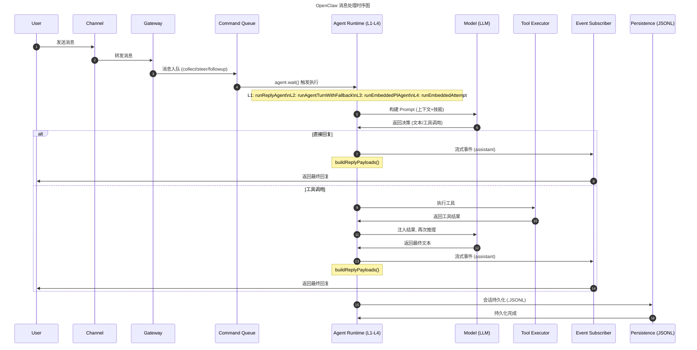
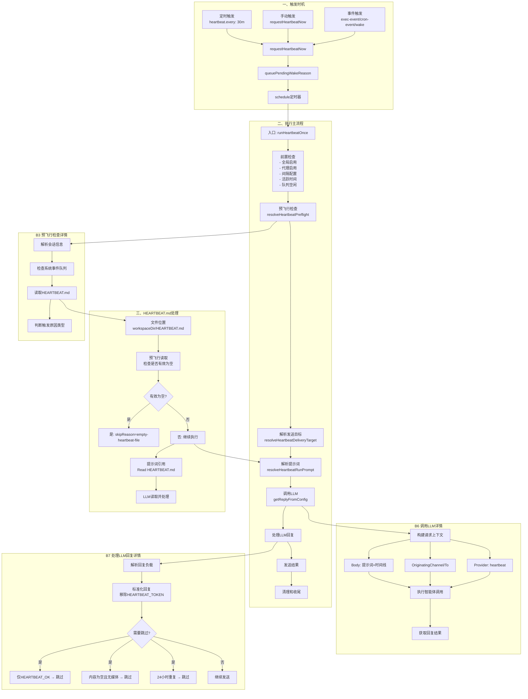

- 目录
{:toc}

---

# 准备工作

- 对话日志目录：`/data/.openclaw/agents/<agent_id>/sessions/<run_id>.jsonl`；
- OpenRouter并不支持查看完整上下文，这里建议接入[LangSmith](https://smith.langchain.com/)库来解决。

# 模型选择规则

## 实际案例

```
"agents": {
    "defaults": {
        "model": {
            "primary": "openrouter/nvidia/nemotron-3-super-120b-a12b:free",
            "fallbacks": ["openrouter/nvidia/llama-nemotron-embed-vl-1b-v2:free"]
        },
        "models": {
            "openrouter/nvidia/nemotron-3-super-120b-a12b:free": {},
            "openrouter/nvidia/llama-nemotron-embed-vl-1b-v2:free": {}
        }
    }
},
"models": {
    "providers": {
        "openrouter": {
            "baseUrl": "https://openrouter.ai/api/v1",
            "apiKey": "${OPENROUTER_API_KEY}",
            "models": [
                {
                    "id": "nvidia/nemotron-3-super-120b-a12b:free",
                    "name": "Nemotron-3 Super 120B",
                    "input": ["text"]
                },
                {
                    "id": "nvidia/nemotron-nano-12b-v2-vl:free",
                    "name": "LLama-Nemotron EmbedEmbedding",
                    "input": ["text", "image"]
                }
            ]
        }
    }
}
```

## 选择规则&优先级

- 当前请求的模型 （动态传入的 provider/model）；
- 单个智能体的 model.fallbacks；
- 全局 agents.defaults.model.fallbacks；
- 全局 agents.defaults.model.primary （最后的保障）；
- 全局允许列表：agents.defaults.models 作为模型白名单，仅列表内的模型可被调用；
- 提供者内部回退：同一模型提供商内的接口 / 认证失败，会先在提供商内部重试，再切换到下一个模型。

# SKILL

- SKILL名称是url链接里的，有很多事重复的，以这个为准，例如https://clawhub.ai/pskoett/self-improving-agent名称是self-improving-agent。
- 可以直接对话里安装SKILL。


## 执行过程



OpenClaw也是用Reasoning and Acting（推理与行动）模式。

## 计算执行方式activeRunQueueAction

| 判断条件                               | activeRunQueueAction |
| -------------------------------------- | -------------------- | --------------------------- |
| 当前无活跃运行？                       | run-now              | typingSignals打字信号       |
| 心跳消息                               | drop                 |                             |
| 应该后续执行 OR messages.queue "steer" | enqueue-followup     | messages.queue默认是collect |
| 默认                                   | run-now              |                             |

## LLM交互案例

### INPUT

#### SYSTEM
SYSTEM 系统角色 / System Prompt，AI 的 “身份说明书” 和 “行为准则”，由开发者设定，是整个对话的「总纲领」。
定义 AI 的角色、任务、回答风格、约束条件（比如 “你是一个专业的天气助手，只回答北京的天气问题，用口语化表达”）。
- 给模型设定上下文背景、规则、格式要求，全程约束模型的输出。
- 只在对话开头出现一次（或少数几次），不会由用户输入。

```markdown
You are a personal assistant running inside OpenClaw.
## Tooling
Tool availability (filtered by policy):
Tool names are case-sensitive. Call tools exactly as listed.
- read: Read file contents
- write: Create or overwrite files
- edit: Make precise edits to files
- exec: Run shell commands (pty available for TTY-required CLIs)
- web_search: Search the web
- web_fetch: Fetch and extract readable content from a URL
```

#### HUMAN&AI
1. HUMAN。human（用户角色 / Human Message），真实用户的提问 / 输入，代表用户的需求、问题、补充信息，是模型需要响应的核心输入。
```
ou_aaaaaa: 明天北京需要带伞吗？
```
1. AI。AI 角色 / Assistant MessageAI 模型自己的历史回复，也就是上一轮对话的 Output。
   - 保存对话历史，让模型理解上下文，实现多轮对话的连贯性。
   - 比如用户追问 “那后天呢？”，模型需要通过 ai 角色的历史回复，知道上一轮已经回答了明天的天气，才能承接上下文。
```
read{"path":"/data/.openclaw/workspace/skills/weather/SKILL.md"}
```
1. HUMAN
```markdown
---
name: weather
description: Get current weather and forecasts (no API key required).
homepage: https://wttr.in/:help
metadata: {"clawdbot":{"emoji":"🌤️","requires":{"bins":["curl"]}}}
---
# Weather
Two free services, no API keys needed.
## wttr.in (primary)
Quick one-liner:
curl -s "wttr.in/London?format=3"
# Output: London: ⛅️ +8°C
```
1. AI
```
exec{"command":"curl -s \"https://api.open-meteo.com/v1/forecast?latitude=39.9042&longitude=116.4074&daily=precipitation_sum&timezone=Asia%2FShanghai\""}
```

1. HUMAN
```
{"latitude":39.875,"longitude":116.375,"generationtime_ms":0.042319297790527344,"utc_offset_seconds":28800,"timezone":"Asia/Shanghai","timezone_abbreviation":"GMT+8","elevation":47.0,"daily_units":{"time":"iso8601","precipitation_sum":"mm"},"daily":{"time":["2026-03-31","2026-04-01","2026-04-02","2026-04-03","2026-04-04","2026-04-05","2026-04-06"],"precipitation_sum":[1.00,0.00,0.00,0.30,1.50,0.00,0.00]}}
```

### OUTPUT（输出）

```
明天北京不需要带伞☀️  
降水量：0.0 mm（干燥）  
可放心出门！ 🌤️
```

- 定义：这是 AI 模型返回的最终响应结果。这一轮它最后吐出的那一条 AI 回复；
- 内容：就是模型给用户的自然语言回答或结构化数据。

# HEARTBEAT

## CLI

```
openclaw system event --text "手动触发心跳" --mode now # 手动执行
openclaw system heartbeat last # 查询上一次执行结果
{
    "ts": 1774963724609,
    "status": "ok-token",
    "reason": "interval",
    "durationMs": 157974,
    "channel": "feishu",
    "silent": true,
    "indicatorType": "ok"
}
```
重点关注`status`、`reason`字段。

## 开启心跳
```
"heartbeat": {
    "every": "30m",
    "target": "feishu",
    "to": "chat:${FEISHU_CHAT_ID}" 
}
// 完整配置
{
    "agents": {
        "defaults": {
            "heartbeat": {
                "every": "30m",              // 触发间隔
                "target": "feishu",          // 发送通道
                "to": "chat:oc_xxx",         // 发送目标 ID
                "prompt": "自定义提示词",     // 可选：自定义提示词
                "model": "特定模型",          // 可选：专用模型
                "accountId": "账号ID",        // 可选：指定账号
                "isolatedSession": true,      // 可选：独立会话
                "lightContext": true,         // 可选：轻量上下文
                "includeReasoning": true,     // 可选：包含思考
                "ackMaxChars": 300,           // 可选：确认字符限制
                "directPolicy": "block"       // 可选：私聊策略
            }
        }
    }
}
```

## 流程图



## 发送结果

| status   | reason               | result                           |
| -------- | -------------------- | -------------------------------- |
| skipped  | disabled             | 心跳功能已禁用                   |
| skipped  | quiet-hours          | 当前处于非活跃时间段             |
| skipped  | requests-in-flight   | 请求队列忙碌，跳过本次心跳       |
| skipped  | empty-heartbeat-file | HEARTBEAT.md 文件内容为空        |
| skipped  | no-target            | 未配置心跳发送目标               |
| skipped  | unknown-account      | 目标账号不存在                   |
| skipped  | dm-blocked           | 私聊被对方阻止                   |
| skipped  | alerts-disabled      | 警报功能已禁用                   |
| skipped  | duplicate            | 心跳内容重复，跳过发送           |
| skipped  | not-due              | 未到下一次心跳执行时间           |
| ok-empty | -                    | 执行成功，但无回复内容           |
| ok-token | -                    | 执行成功，返回 HEARTBEAT_OK 标识 |
| sent     | -                    | 心跳消息发送成功                 |
| failed   | -                    | 心跳消息发送失败                 |

## 交互案例

与SKILL区别不大，提示词如下：
```
Read HEARTBEAT.md if it exists (workspace context). Follow it strictly. Do not infer or repeat old tasks from prior chats. If nothing needs attention, reply HEARTBEAT_OK.
When reading HEARTBEAT.md, use workspace file /data/.openclaw/workspace/HEARTBEAT.md (exact case). Do not read docs/heartbeat.md.
Current time: Tuesday, March 31st, 2026 — 04:15 (UTC) / 2026-03-31 04:15 UTC
```


