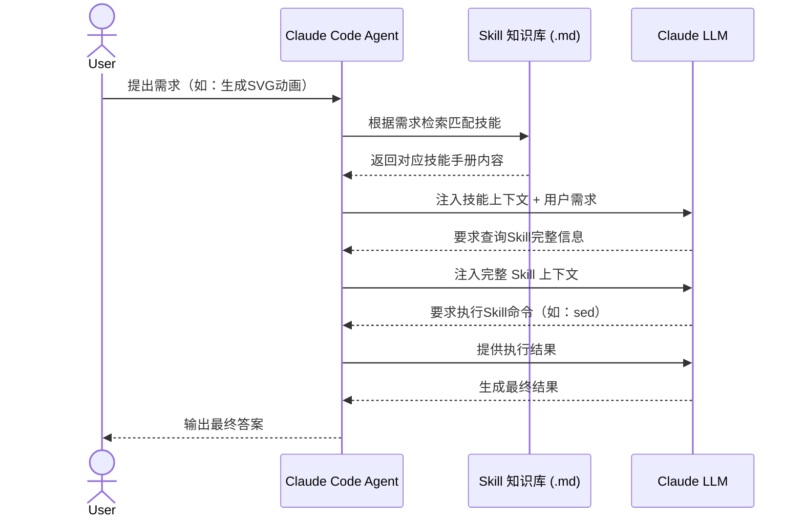

- 目录
{:toc}

---

# AGENTS.md

用于指导编码Agent的简单、开放格式。将 AGENTS.md 视为代理商的README：一个专门、可预测的场所，提供背景和指示，帮助AI编码Agent为您的项目工作。

## 跟README.md的区别
README.md 是写给人看的：包含快速上手、项目说明与贡献指南。
AGENTS.md 则作为补充，存放编码智能体所需的额外信息（有时是详细上下文）：构建步骤、测试流程与开发规范 —— 这些内容若放进 README 会显得冗余，或对人工贡献者无关紧要。
我们特意将二者分开，目的是：
- 为智能体提供一个清晰、固定的指令存放位置
- 让 README 保持简洁，聚焦于人工贡献者
- 提供精准、面向智能体的指引，作为现有 README 与文档的补充
我们没有新增一种专属文件格式，而是选用了对所有人都通用的命名与格式。如果你在开发或使用编码智能体时觉得这份文件有用，欢迎直接沿用。

## 兼容性

目前支持超过24种Agent和工具，而且CLAUDE.md在我看来也是一回事，另外Trae也兼容这个格式。

## 如何使用

放在项目根目录里，或者用`/init`初始化。

## 例子

详细内容可移步官方文档：[AGENTS.md规范](https://agents.md/#examples)

- Project overview：项目概述
- Build and test commands：构建与测试命令
- Code style guidelines：代码风格规范
- Testing instructions：测试说明
- Security considerations：安全注意事项

```
# AGENTS.md

## Project Overview
项目的整体目标与架构简介

## Build & Commands
用于开发、测试与部署的常用命令

## Code Style
格式化规则、命名规范与最佳实践

## Testing
测试框架、约定及执行指南

## Security
安全注意事项与数据保护策略

## Configuration
环境配置方式与配置管理说明
```

# SKILL.md

一种简洁、开放的格式，用于为智能体赋予新能力与专业知识。
智能体技能是由说明文档、脚本和资源组成的文件夹，智能体可以发现并使用它们，从而更准确、更高效地完成任务。

智能体的能力日益增强，但往往缺少可靠完成实际工作所需的上下文信息。技能体系很好地解决了这一问题：它让智能体能够获取流程化知识，以及企业、团队和用户专属的上下文，并可按需加载。具备技能库的智能体，能够根据当前执行的任务灵活扩展自身能力。
面向技能开发者：一次构建能力，即可在多款智能体产品中复用部署。
面向兼容的智能体：支持技能体系，可让终端用户开箱即用地为智能体赋予新能力。
面向团队与企业：将组织知识沉淀为可移植、可版本控制的标准化包。

智能体技能可以实现哪些能力？
- 领域专业知识：将专业知识打包为可复用的指令，涵盖法律审查流程、数据分析流程等各类专业场景。
- 全新能力：为智能体赋予新技能（例如制作演示文稿、搭建 MCP 服务器、分析数据集）。
- 可复用工作流：将多步骤任务转化为统一、可审计的工作流程。
- 互通兼容性：在不同兼容技能的智能体产品中，复用同一套技能。

## Skill的结构

从本质上讲，一项技能就是一个包含 SKILL.md 文件的文件夹。该文件包含元数据（至少包含名称和描述）以及指导智能体如何执行特定任务的说明。技能还可以打包脚本、模板和参考资料。

```
my-skill/
├── SKILL.md          # Required: instructions + metadata
├── scripts/          # Optional: executable code
├── references/       # Optional: documentation
└── assets/           # Optional: templates, resources
```

| 位置 | 路径                                   | 适用于         |
| ---- | -------------------------------------- | -------------- |
| 个人 | ~/.claude/skills/<skill-name>/SKILL.md | 你的所有项目   |
| 项目 | .claude/skills/<skill-name>/SKILL.md   | 仅此项目       |
| 插件 | <plugin>/skills/<skill-name>/SKILL.md  | 启用插件的位置 |

## 如何工作

- 发现阶段：启动时，智能体仅加载每项可用技能的名称与描述，只需足够判断该技能是否相关即可。
- 激活阶段：当任务与某项技能的描述匹配时，智能体才会将完整的 SKILL.md 指令加载到上下文。
- 执行阶段：智能体按照指令执行任务，并可根据需要按需加载引用文件或执行捆绑的代码。

## 例子

- 详细内容可移步官方文档：[SKILL.md规范](https://agentskills.io/specification)
- 更多例子：[UI UX Pro Max](https://github.com/nextlevelbuilder/ui-ux-pro-max-skill)
- [使用 skills 扩展 Claude - Claude Code Docs](https://code.claude.com/docs/zh-CN/skills#%E7%94%9F%E6%88%90%E8%A7%86%E8%A7%89%E8%BE%93%E5%87%BA)

```
---
name: 技能名称
description: 简要描述这个技能的功能和使用场景

---

# 技能名称

## 描述
描述这个技能的作用。

## 使用场景
描述触发这个技能的条件。

## 指令
清晰的分步说明，告诉智能体具体怎么做。

## 示例 (可选)
输入/输出示例，展示预期效果。
```

## 渐进式拉取skill




