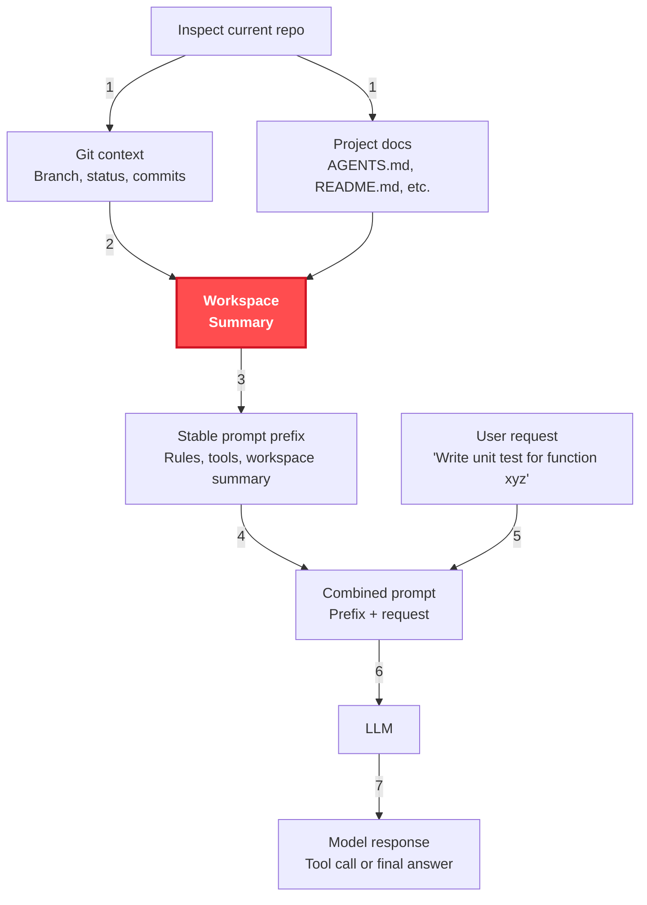
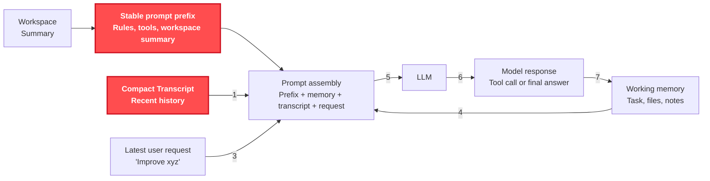
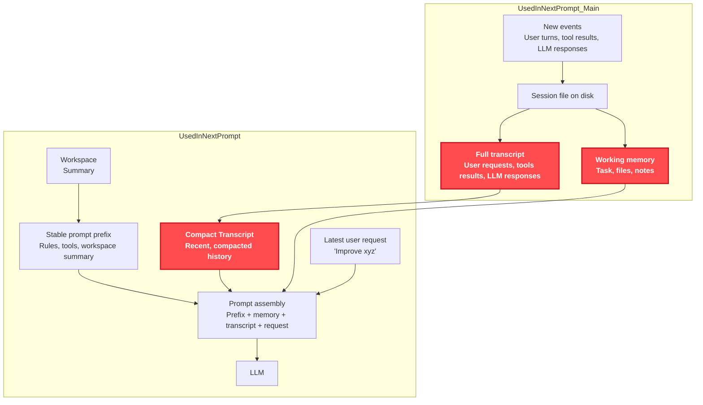
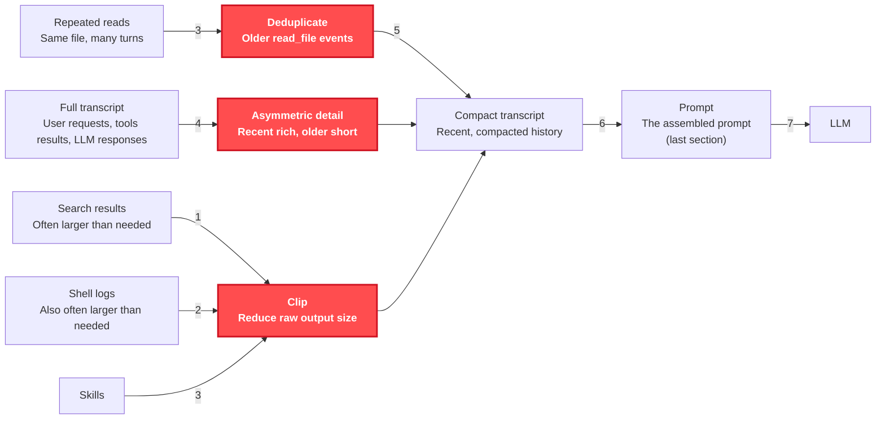
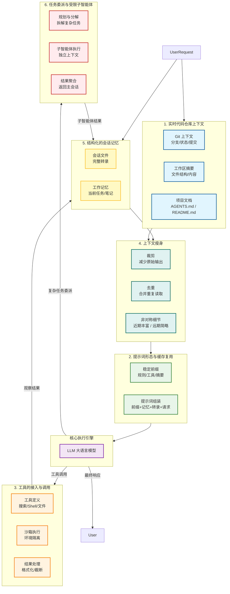

- 目录
{:toc}

---

# AI工程化三阶段

| 维度       | Prompt Engineering（提示词工程） | Context Engineering（上下文工程） | Harness Engineering（驾驭 / 控束工程） |
| ---------- | -------------------------------- | --------------------------------- | -------------------------------------- |
| 核心定位   | 指令优化                         | 信息供给                          | 系统控制                               |
| 通俗比喻   | 写台词                           | 搭布景 / 查资料                   | 造赛车 / 拉缰绳                        |
| 解决问题   | 模型听不懂、答非所问             | 模型记不住、知识匮乏              | 模型不靠谱、不可控、不安全             |
| 操作对象   | 纯文本字符串（Prompt）           | 会话历史 + 外部知识库（**RAG**）  | 整个 Agent 生命周期 + 外部工具         |
| 技术手段   | 角色设定、Few-shot、CoT、模板    | 会话管理、向量检索、窗口截断      | 状态机、函数调用、护栏、自愈闭环       |
| 代码复杂度 | 低（字符串拼接）                 | 中（数据库 / 向量库交互）         | 高（循环逻辑、异常处理）               |
| 交互层级   | 单次交互（点）                   | 多轮记忆（面）                    | 自主执行（体）                         |
| 代表产物   | 各种提示词模板、咒语             | RAG 系统、聊天记录管理器          | OpenClaw、AutoGPT、Claude Code         |

# Code Harness Engineering架构

Code Harness = 模型层 + 智能体循环 + 运行时支撑
- 模型层：LLM / Reasoning LLM（引擎）
- 智能体循环：Observe → Inspect → Choose → Act（决策闭环）
- 运行时支撑：上下文、工具、权限、缓存、记忆、子代理（脚手架）


## 第一阶段：系统启动与加载（构建底座）

### 1. 实时代码仓库上下文 (Live Repo Context)



### 2. 提示词形态与缓存复用 (Prompt Shape And Cache Reuse)



纯聊天式的 LLM 使用中，每一轮对话都会把所有内容（规则、工具、仓库信息、历史对话）重建成一个完整的大 Prompt。
- 结构化拆分 Prompt，分离「稳定前缀」与「动态内容」
- 标准化 Prompt Shape（形态），保证推理稳定性
- 对稳定前缀做缓存复用，降本提效
- 联动全链路模块，为 Agent 循环打基础

#### Stable Prompt Prefix（稳定提示词前缀）——CLAUDE.md

CLAUDE.md 文件：你编写的指令，为 Claude 提供持久上下文。CLAUDE.md不会被压缩，每个文件目标在 200 行以下。

```
your-project/
├── .claude/
│   ├── CLAUDE.md           # 主项目指令
│   └── rules/
│       ├── code-style.md   # 代码样式指南
│       ├── testing.md      # 测试约定
│       └── security.md     # 安全要求
```

#### Rules

CLAUDE.md 是「主项目说明」，rules 是「模块化补充规则」，二者共同构成项目级稳定提示词前缀，且 rules 优先级更高。

| 类型      | 位置                               | 核心定位       | 内容特点                                             |
| --------- | ---------------------------------- | -------------- | ---------------------------------------------------- |
| CLAUDE.md | ./CLAUDE.md 或 ./.claude/CLAUDE.md | 主项目说明     | 项目整体架构、全局约定、常用命令、团队共享的核心规则 |
| rules     | ./.claude/rules/*.md               | 模块化专项规则 | 特定语言指南、测试约定、API 标准、安全要求等细分主题 |

## 第二阶段：对话运行与组装（核心循环）

### 5. 结构化的会话记忆 (Structured Session Memory)



#### 记忆系统Memory:

- 自动记忆：Claude 根据你的更正和偏好自己编写的笔记
- 使用Sonnet模型，扫描 memory 目录下所有 .md，排除 MEMORY.md，只读每个文件前 30 行 frontmatter，按 mtime 倒序排序，最多保留 200 个候选

| CLAUDE.md 文件             | 自动记忆                              |
| -------------------------- | ------------------------------------- |
| 你                         | Claude                                |
| 指令和规则                 | 学习和模式                            |
| 项目、用户或组织           | 每个工作树                            |
| 每个会话                   | 每个会话（前 200 行或 25KB）          |
| 编码标准、工作流、项目架构 | 构建命令、调试见解、Claude 发现的偏好 |

打开方式：
```
{
  "autoMemoryEnabled": false
  "autoMemoryDirectory": "~/my-custom-memory-dir"
}
```

存储方式：
```
~/.claude/projects/<project>/memory/
├── MEMORY.md          # 简洁索引，加载到每个会话
├── debugging.md       # 关于调试模式的详细笔记
├── api-conventions.md # API 设计决策
└── ...                # Claude 创建的任何其他主题文件
```

#### 会话Transcript：

| 层级                | 项目                                | 保存位置                                     | 存储内容                                                                  | 生命周期                                                 |
| ------------------- | ----------------------------------- | -------------------------------------------- | ------------------------------------------------------------------------- | -------------------------------------------------------- |
| 请求级 / 进程级缓存 | readFileState                       | 进程内 LRU 内存缓存                          | 已读取文件的内容快照，以及 mtime、offset、limit、isPartialView 等读取状态 | 仅当前进程有效；LRU 淘汰；进程退出即丢失                 |
| 请求级 / 进程级缓存 | fileReadCache                       | 进程内 Map                                   | 某些文件读取结果及其 mtime                                                | 仅当前进程有效；依赖 mtime 失效；进程退出即丢失          |
| 请求级 / 进程级缓存 | FileIndex                           | 进程内索引对象                               | 文件路径和目录路径的模糊检索索引，不包含文件正文                          | 仅当前进程有效；可重建；进程退出即丢失                   |
| 请求级 / 进程级缓存 | ignore 过滤缓存                     | 进程内缓存                                   | .ignore、.gitgnore 解析后的过滤规则                                       | 仅当前进程有效；进程退出即丢失                           |
| 请求级 / 进程级缓存 | GitFileWatcher cache                | 进程内 watcher/cache                         | 当前 branch、HEAD、default branch、remote URL 等 git 元信息               | 仅当前进程有效；.git 变化时失效；进程退出即丢失          |
| 项目级持久化        | exampleFiles                        | 项目配置                                     | 由 git log 推导出的高频修改文件列表及时间戳                               | 跨进程、跨会话保留；按项目保存；过期后重算               |
| 会话级持久化        | session transcript                  | ~/.claude/projects/.../<sessionId>.jsonl     | 会话消息、工具结果摘要、快照事件、替换记录、折叠记录等 JSONL 事件流       | 跟随 session 长期存在；用于 resume/continue              |
| 会话级持久化        | attribution snapshot                | ~/.claude/projects/.../<sessionId>.jsonl     | Claude / 人工改动归因状态                                                 | 跟随 session transcript 存在；恢复会话时加载             |
| 会话级持久化        | file-history snapshot               | ~/.claude/projects/.../<sessionId>.jsonl     | 文件版本快照的索引信息，如文件路径、版本号、关联备份名                    | 跟随 session transcript 存在；用于恢复文件历史状态       |
| 会话级持久化        | content-replacement                 | ~/.claude/projects/.../<sessionId>.jsonl     | 上下文压缩 / 替换后的映射关系                                             | 跟随 session transcript 存在；服务长会话恢复             |
| 会话级持久化        | context-collapse / related snapshot | ~/.claude/projects/.../<sessionId>.jsonl     | 上下文折叠后的提交点、摘要快照及相关恢复信息                              | 跟随 session transcript 存在；服务 resume/continue       |
| 会话级文件实体      | file-history 备份文件               | ~/.claude/file-history/<sessionId>/<hash>@vN | 文件某个版本的真实内容副本                                                | 跟随该 session 的文件历史存在；可在 resume 时复制 / 复用 |

- 进程级：都是性能缓存，退出即丢。
- 项目级：只有 exampleFiles 这类轻量衍生缓存。
- 会话级：核心都写进 ~/.claude/projects/.../*.jsonl。
- 文件实体级：真正的旧文件内容只在 ~/.claude/file-history/<sessionId>/...。


## 第三阶段：工具执行与安全管控（驾驭核心）

### 3. 工具的接入与调用 (Tool Access and Use)


| 领域                | 实现方式                                                                                               | 关键配置项                                                                                                                                                                                         |
| ------------------- | ------------------------------------------------------------------------------------------------------ | -------------------------------------------------------------------------------------------------------------------------------------------------------------------------------------------------- |
| 命令 / 工具执行权限 | 先匹配通用工具规则，再进入工具自己的 checkPermissions ()，最后叠加 mode、bypass、dangerous rule 处理   | permissions.allow、permissions.deny、permissions.ask、permissions.defaultMode、permissions.disableBypassPermissionsMode、permissions.disableAutoMode                                               |
| 文件系统权限        | 基于路径规则、工作目录边界、敏感路径 / 危险路径检查做 allow/deny/ask；编辑类工具会单独接入文件权限检查 | permissions.additionalDirectories、permissions.allow/deny/ask                                                                                                                                      |
| 外部访问权限        | WebFetch 做 host/path 级规则；MCP 先做 server 级启用 / 批准 / 企业策略，再到具体 MCP tool 权限         | allowedMcpServers、deniedMcpServers、enableAllProjectMcpServers、enabledMcpjsonServers、disabledMcpjsonServers、allowManagedMcpServersOnly、allowManagedPermissionRulesOnly、skipWebFetchPreflight |

相关配置：[Claude Code 完整使用指南](https://www.claude-cn.org/posts/claude-code-complete-guide#_6%EF%B8%8F%E2%83%A3-%E5%AE%89%E5%85%A8%E5%92%8C%E6%9D%83%E9%99%90%E7%AE%A1%E7%90%86-%E2%80%8B)

#### 低幻觉

- 生成 → 执行 → 验证 → 诊断 → 自愈 → 再执行
- 闭环 = 零幻觉、高可靠的根本原因

#### 强力提示词

- `src/services/compact/prompt.ts:19`：明确要求 Your entire response must be plain text: an <analysis> block followed by a <summary> block.这是最直接的“先分析再给总结”。
- `src/services/compact/prompt.ts:31`：Before providing your final summary, wrap your
analysis in <analysis> tags...，属于硬性两阶段输出。
- `src/commands/security-review.ts:92`：有 ANALYSIS METHODOLOGY，后面分 Phase 1/2/3做仓库研究、对比分析、漏洞评估，明显是先论证再结论。
- `src/commands/security-review.ts:130`：要求 FALSE POSITIVE FILTERING 和 confidence score，不是简单找问题，而是要求证据和置信度。
- `src/memdir/memoryTypes.ts:201`：Before answering the user ... verify that the memory is still correct and up-to-date，这是“先验证再回答”。
- `src/coordinator/coordinatorMode.ts:328`：Prove the code works, don't just confirm it exists，要求给可验证依据，不接受口头确认。

## 第四阶段：上下文瘦身（防爆炸与优化）

### 4. 给上下文瘦身，防止撑爆 (Minimizing Context Bloat)

在长会话（比如写代码、改项目）中，AI 会产生大量冗余信息，如果全部塞给 LLM，会：
- 超 Token 限制（报错）
- 算力成本飙升
- AI 注意力分散（记不住重点）
所以，必须做 上下文压缩（Context Compression）。

1. Clip（裁剪）把过长的搜索结果、Shell 日志，截断到合适长度。
2. Deduplicate（去重），删掉旧的、重复的文件读取记录，避免重复信息干扰。
3. Asymmetric detail（非对称细节）。最近的对话保留详细信息，久远的对话只保留摘要。AI 对最近的事记得最清，对很久以前的事只需要大概印象。
4. Compact transcript（精简转录）。经过上面 3 步处理后，得到一个短小、干净、无冗余的历史记录。
5. Prompt assembly（组装）。把精简后的历史，和其他信息（规则、任务、记忆）拼成最终 Prompt，发给 LLM。

#### 压缩时机

- 手动执行：`/compact`。/compact 能明显压缩当前会话上下文，让后续对话继续跑下去；但它不会把磁盘上的 transcript JSONL 文件变小。
- 自动执行：系统在上下文快满时自动做的 autoCompact

#### 压缩方式

压缩内容：session transcript 
在这条链上插入 compact boundary 和 compact summary
- 之后模型只取 boundary 后面的消息继续工作
- 所以被“压缩”的是 transcript 里的会话历史视图



## 第五阶段：任务委派与复杂场景

### 6. 任务委派与受限子智能体 (Delegation With (Bounded) Subagents)

官方文档：[创建自定义 subagents](https://code.claude.com/docs/zh-CN/sub-agents)

#### 配置方式
```
claude --agents '{
  "code-reviewer": {
    "description": "Expert code reviewer. Use proactively after code changes.",
    "prompt": "You are a senior code reviewer. Focus on code quality, security, and best practices.",
    "tools": ["Read", "Grep", "Glob", "Bash"],
    "model": "sonnet"
  },
  "debugger": {
    "description": "Debugging specialist for errors and test failures.",
    "prompt": "You are an expert debugger. Analyze errors, identify root causes, and provide fixes."
  }
}'
```

#### 调用方式

- 自动委托：Claude 根据您请求中的任务描述、subagent 配置中的 description 字段和当前上下文自动委托任务。要鼓励主动委托，在您的 subagent 的 description 字段中包含”use proactively”之类的短语。
- 显示调用
  - 自然语言：在提示中命名 subagent；Claude 决定是否委托
  - @-mention：保证 subagent 为一个任务运行
  - 会话范围：整个会话使用该 subagent 的系统提示、工具限制和模型，通过 --agent 标志或 agent 设置

## 完整架构图



# 更多阅读
- [2026 AI 开发新范式：Harness Engineering（驾驭工程）为何是智能体的决胜点？](https://mp.weixin.qq.com/s?__biz=MzY4NzAzOTMxMQ==&mid=2247483770&idx=1&sn=f35fe72584f3a06e415374b93866e52e&chksm=f285a3b7f5525c7728c4786d9cdb2d537175bbc80ab29cdfcf82306cc0ceeb67679d47766b52&mpshare=1&srcid=0405ou8kKlrFZwUPMWG0RKdg&sharer_shareinfo=ca6d0395e3844d726629609a65950860&sharer_shareinfo_first=ca6d0395e3844d726629609a65950860&from=timeline&scene=2&subscene=1&sessionid=1775389781&clicktime=1775393610&enterid=1775393610&ascene=2&fasttmpl_type=0&fasttmpl_fullversion=8198750-zh_CN-zip&fasttmpl_flag=0&realreporttime=1775393610299&devicetype=android-36&version=2800455e&nettype=WIFI&abtest_cookie=AAACAA%3D%3D&lang=zh_CN&countrycode=CN&exportkey=n_ChQIAhIQLrV3Z6FNARBA18j6HgJWhhLZAQIE97dBBAEAAAAAAMF4EGXkL1oAAAAOpnltbLcz9gKNyK89dVj05Fua3wl%2BOMIR6nYzbVRQBjfErWIK0N4guPCG7YeZuqKnrUZN%2FHW874oZ9E%2F8tS49gafo3KWnb6Ut%2F16f8u8Ew23eUaI8YTD%2BF1L7JeKTAP73H%2BCdM3Y7BqzPgZ%2B5t4PUj8UKuj2Fo%2Fsbcz6SbulnaWlp9dXHcZ4%2FbQSOrTwPqrO2EEclzAhjqxAKDoHf1tIi4IZ5verd7%2BJU%2Fn2xordqbyecazhHe6JpAlt%2FopoJaeXvNZE%3D&pass_ticket=STXDxqr1fHzDxQgY62AnLArtheY%2Bt%2BnwvStnOl71NpzsFioMSJ%2BoMzc5Vo6XrORM&wx_header=3)   
- [HComponents of A Coding Agent](https://magazine.sebastianraschka.com/p/components-of-a-coding-agent)


