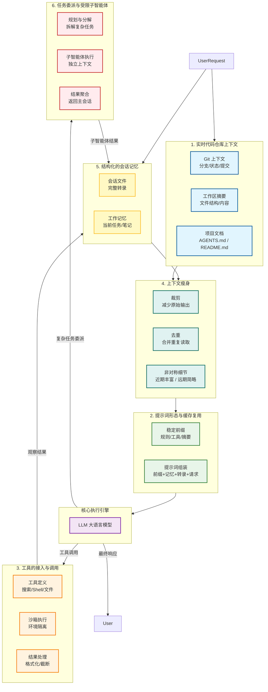

- 目录
{:toc}

---

# AI工程化三阶段

| 维度       | Prompt Engineering（提示词工程） | Context Engineering（上下文工程） | Harness Engineering（驾驭 / 控束工程） |
| ---------- | -------------------------------- | --------------------------------- | -------------------------------------- |
| 核心定位   | 指令优化                         | 信息供给                          | 系统控制                               |
| 通俗比喻   | 写台词                           | 搭布景 / 查资料                   | 造赛车 / 拉缰绳                        |
| 解决问题   | 模型听不懂、答非所问             | 模型记不住、知识匮乏              | 模型不靠谱、不可控、不安全             |
| 操作对象   | 纯文本字符串（Prompt）           | 会话历史 + 外部知识库（**RAG**）  | 整个 Agent 生命周期 + 外部工具         |
| 技术手段   | 角色设定、Few-shot、CoT、模板    | 会话管理、向量检索、窗口截断      | 状态机、函数调用、护栏、自愈闭环       |
| 代码复杂度 | 低（字符串拼接）                 | 中（数据库 / 向量库交互）         | 高（循环逻辑、异常处理）               |
| 交互层级   | 单次交互（点）                   | 多轮记忆（面）                    | 自主执行（体）                         |
| 代表产物   | 各种提示词模板、咒语             | RAG 系统、聊天记录管理器          | OpenClaw、AutoGPT、Claude Code         |

# Code Harness Engineering架构

Code Harness = 模型层 + 智能体循环 + 运行时支撑
- 模型层：LLM / Reasoning LLM（引擎）
- 智能体循环：Observe → Inspect → Choose → Act（决策闭环）
- 运行时支撑：上下文、工具、权限、缓存、记忆、子代理（脚手架）

## 第一阶段：系统启动与加载（构建底座）

### 1. 实时代码仓库上下文 (Live Repo Context)

### 2. 提示词形态与缓存复用 (Prompt Shape And Cache Reuse)

**LLM 被 “隔离”，只负责思考，不负责执行**
**上下文被严格管理，不会乱、不会忘**
**提示词被工程化，不是手写，而是自动组装**

1. Compact Transcript（精简对话历史）
2. Stable Prompt Prefix（稳定提示词前缀）
3. Latest user request（最新用户请求）
4. Working Memory（工作记忆）
5. Prompt assembly（提示词组装）。
6. LLM（大模型）
7. Model response（模型输出）

## 第二阶段：对话运行与组装（核心循环）

### 5. 结构化的会话记忆 (Structured Session Memory)

## 第三阶段：工具执行与安全管控（驾驭核心）

## 3. 工具的接入与调用 (Tool Access and Use)

## 第四阶段：上下文瘦身（防爆炸与优化）

## 4. 给上下文瘦身，防止撑爆 (Minimizing Context Bloat)

在长会话（比如写代码、改项目）中，AI 会产生大量冗余信息，如果全部塞给 LLM，会：
- 超 Token 限制（报错）
- 算力成本飙升
- AI 注意力分散（记不住重点）
所以，必须做 上下文压缩（Context Compression）。

1. Clip（裁剪）把过长的搜索结果、Shell 日志，截断到合适长度。
2. Deduplicate（去重），删掉旧的、重复的文件读取记录，避免重复信息干扰。
3. Asymmetric detail（非对称细节）。最近的对话保留详细信息，久远的对话只保留摘要。AI 对最近的事记得最清，对很久以前的事只需要大概印象。
4. Compact transcript（精简转录）。经过上面 3 步处理后，得到一个短小、干净、无冗余的历史记录。
5. Prompt assembly（组装）。把精简后的历史，和其他信息（规则、任务、记忆）拼成最终 Prompt，发给 LLM。

## 第五阶段：任务委派与复杂场景

### 6. 任务委派与受限子智能体 (Delegation With (Bounded) Subagents)

## 完整架构图

# 更多阅读
- [2026 AI 开发新范式：Harness Engineering（驾驭工程）为何是智能体的决胜点？](https://mp.weixin.qq.com/s?__biz=MzY4NzAzOTMxMQ==&mid=2247483770&idx=1&sn=f35fe72584f3a06e415374b93866e52e&chksm=f285a3b7f5525c7728c4786d9cdb2d537175bbc80ab29cdfcf82306cc0ceeb67679d47766b52&mpshare=1&srcid=0405ou8kKlrFZwUPMWG0RKdg&sharer_shareinfo=ca6d0395e3844d726629609a65950860&sharer_shareinfo_first=ca6d0395e3844d726629609a65950860&from=timeline&scene=2&subscene=1&sessionid=1775389781&clicktime=1775393610&enterid=1775393610&ascene=2&fasttmpl_type=0&fasttmpl_fullversion=8198750-zh_CN-zip&fasttmpl_flag=0&realreporttime=1775393610299&devicetype=android-36&version=2800455e&nettype=WIFI&abtest_cookie=AAACAA%3D%3D&lang=zh_CN&countrycode=CN&exportkey=n_ChQIAhIQLrV3Z6FNARBA18j6HgJWhhLZAQIE97dBBAEAAAAAAMF4EGXkL1oAAAAOpnltbLcz9gKNyK89dVj05Fua3wl%2BOMIR6nYzbVRQBjfErWIK0N4guPCG7YeZuqKnrUZN%2FHW874oZ9E%2F8tS49gafo3KWnb6Ut%2F16f8u8Ew23eUaI8YTD%2BF1L7JeKTAP73H%2BCdM3Y7BqzPgZ%2B5t4PUj8UKuj2Fo%2Fsbcz6SbulnaWlp9dXHcZ4%2FbQSOrTwPqrO2EEclzAhjqxAKDoHf1tIi4IZ5verd7%2BJU%2Fn2xordqbyecazhHe6JpAlt%2FopoJaeXvNZE%3D&pass_ticket=STXDxqr1fHzDxQgY62AnLArtheY%2Bt%2BnwvStnOl71NpzsFioMSJ%2BoMzc5Vo6XrORM&wx_header=3)   
- [HComponents of A Coding Agent](https://magazine.sebastianraschka.com/p/components-of-a-coding-agent)


