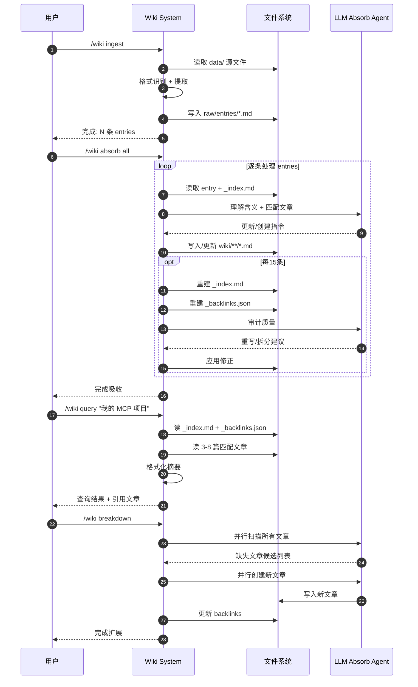
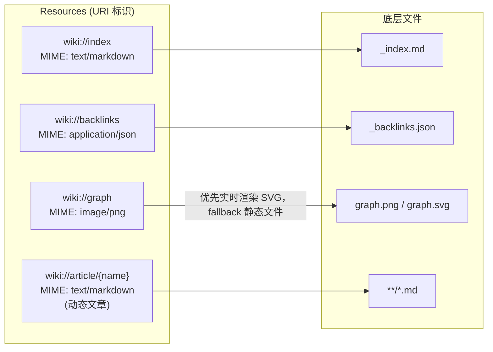

- 目录
{:toc}

---

# LLM Wiki

LLM Wiki 是由 Andrej Karpathy（OpenAI 联合创始人、前特斯拉 AI 总监）于 2026 年提出的个人知识库构建新范式，核心是让大语言模型（LLM）充当 “知识编译器” 和 “图书管理员”，自动将零散资料构建为可持久化、结构化、可复利增长的维基（Wiki）系统。

| 对比维度     | 传统 RAG                            | LLM Wiki                                    |
| ------------ | ----------------------------------- | ------------------------------------------- |
| 提出背景     | 经典检索增强生成方案                | Andrej Karpathy 2026 提出的新知识库范式     |
| 知识形态     | 原始文档 / 碎片化文本，无结构化整理 | 预编译为结构化 Wiki（Markdown），持久沉淀   |
| 工作方式     | 每次提问→实时检索→临时合成          | 先将资料编译为 Wiki，提问直接查询整理后知识 |
| 知识关联     | 弱关联，信息碎片化                  | 强交叉引用，体系化、复利式增长              |
| 查询效率     | 重复检索计算，效率较低              | 直接读取预编译内容，响应更快                |
| 维护成本     | 人工整理成本高，难更新              | LLM 自动维护、巡检、更新、去重              |
| 依赖组件     | 需向量数据库、Embedding 模型        | 仅文件系统，无需向量库，轻量简洁            |
| 知识可追溯性 | 检索片段零散，可读性差              | Wiki 页面清晰，可直接阅读、编辑、迁移       |
| 适用场景     | 临时问答、单次信息查询              | 长期知识管理、个人 / 团队知识库建设         |
| 核心特点     | 即用即查，无积累                    | 知识可沉淀、可复利、可长期迭代优化          |

# 试用

在[Cyeam.com](https://cyeam.com/)任意网站点击页面头部的「求助架构师」或者输入cmd+K，即可调用 LLM Wiki 功能。

# 如何搭建一个 LLM 可查询的个人知识库（Wiki）

所有源码均在[cyeam-mcp](https://github.com/cyeam/cyeam-mcp)项目中。

因为Golang对本地Skills支持有限，我们采用MCP方式把知识库查询功能暴露给任意 AI 助手。

## 生成知识库



## MCP 协议用法

MCP (Model Context Protocol) 中，服务器向 LLM 客户端暴露的内容分为三类：

| 类别          | 作用                   | 类比               |
| ------------- | ---------------------- | ------------------ |
| **Tools**     | LLM 可以主动调用的函数 | LLM 的"手脚"       |
| **Resources** | LLM 可以直接读取的内容 | LLM 的"参考资料"   |
| **Prompts**   | 预定义的提示词模板     | LLM 的"使用说明书" |

下面逐一说明本项目是如何设计这三类接口的。

---

## Tools（工具）

Tools 是 LLM 主动调用的函数。本项目暴露了 5 个工具，其中 4 个是 Wiki 核心：

### 1. `wiki_query` — 核心检索入口

**功能：** 根据用户的自然语言问题，从知识库中找到 3-8 篇最相关的文章，拼接成上下文返回。

**输入：**
- `question` (string, required): 用户的问题
- `depth` (integer, default=2): Wikilink 展开的层数（1-3）

**设计意图：**

> LLM 的上下文窗口是有限的，不可能把所有 Markdown 一次性塞进去。

所以必须有一个"相关性引擎"帮 LLM 做预筛选。`wiki_query` 内部做了四件事：

1. **索引匹配**：把用户问题和 `_index.md` 里的标题、别名、描述做文本打分
2. **反向链接扩展**：把引用过目标文章的其他文章也拉进来（如 `[[Go 性能优化]]` 被 `[[2025 年技术栈]]` 引用，后者也纳入）
3. **Wikilink 展开**：按 `depth` 层数递归追踪文章里的 `[[...]]` 链接，拉入关联文章
4. **截断组装**：单篇超过 4000 字符自动截断，最终打包成 Markdown 返回

**效果：** LLM 拿到的是"刚好够回答这个问题"的上下文，而非全部笔记。

---

### 2. `wiki_get_article` — 精读入口

**功能：** 按名字或路径读取单篇文章的完整内容。

**输入：**
- `name` (string, required): 文章标题或相对路径（不含 `.md`）

**设计意图：**

当 `wiki_query` 返回的摘要不够详细时，LLM 可以用这个工具深入读某一篇。实现"先粗后精"的查询策略。

---

### 3. `wiki_search_index` — 快速发现

**功能：** 在 `_index.md` 的标题、别名、描述中搜索关键词，快速列出相关文章清单。

**输入：**
- `keyword` (string, required): 搜索关键词

**设计意图：**

用户说"找一下 Claude 相关的"时，先列清单比直接读全文更高效。LLM 拿到列表后可以决定读哪几篇。

---

### 4. `wiki_get_graph` — 可视化入口

**功能：** 返回知识图谱图片（`static/graph.png` 或 `static/graph.svg`）。

**设计意图：**

用户问"这些概念之间什么关系""有没有可视化"时，LLM 可以读取这张图并描述给用户。适合整体概览类的问题。

---

## 二、Resources（资源）

Resources 是 LLM 可以直接通过 URI 读取的原始内容，相当于把文件系统映射成网络资源。它是**被动暴露**的数据源，AI 客户端可以像访问 URI 一样直接读取，不需要参数计算。：

| Resource URI            | 内容                    | MIME 类型          |
| ----------------------- | ----------------------- | ------------------ |
| `wiki://index`          | `_index.md` 全文        | `text/markdown`    |
| `wiki://backlinks`      | `_backlinks.json` 全文  | `application/json` |
| `wiki://graph`          | `static/graph.png` 图片 | `image/png`        |
| `wiki://article/<name>` | 单篇完整文章            | `text/markdown`    |



### 为什么既有 Tools 又有 Resources？

因为**使用场景不同**：

- **Tools 是"智能的"** — 带算法、带筛选。LLM 不需要知道文件在哪，调用 `wiki_query("Claude Code 怎么用")`，引擎自动找相关文章。
- **Resources 是"原始的"** — 不带算法，直接暴露原始数据。适合 LLM 想"我自己来翻"的场景，或客户端想直接展示索引列表。

**设计哲学：**
> 对于"查询类"需求，LLM 不擅长在海量文本里做精确检索，所以用 Tool 封装检索逻辑；对于"已知要找什么"的需求，直接用 Resource URI 读取更高效。

---

## 三、Prompts（提示词）

Prompts 是预定义的提示词模板，教 LLM **如何正确使用这个 Wiki**：

### 1. `wiki_query_system` — 系统提示词

核心规则：

1. **优先使用 `wiki_query`** — 用户问任何知识库相关问题，直接调工具，不要自己猜
2. **不读 raw entries，只读 wiki 文章** — 防止 LLM hallucination
3. **内容不够时再用 `wiki_get_article`** — 先粗后精
4. **关系图问题用 `wiki_get_graph`** — 不要编造图中不存在的节点
5. **不要编造** — 知识库没覆盖就明确告知用户

### 2. `tech_news_prompt` — 新闻总结提示词

模板化的新闻总结指令，供 LLM 在获取 `tech_news` 数据后调用。

### 为什么要单独暴露 Prompts？

MCP 协议允许客户端在连接时**自动拉取服务器的提示词**。这意味着：

- 换不同的 LLM 客户端（Claude Code、Cursor、自研 Agent），它们都能自动获取"如何查询这个 wiki"的说明书
- 提示词和代码解耦，想改查询策略时不用改每个客户端的配置

---

## 四、整体调用链路

```
用户提问
    │
    ▼
LLM 收到问题 + wiki_query_system 提示词
    │
    ├── 判断需要查询 ──► 调用 wiki_query(question)
    │                      │
    │                      ▼
    │                   引擎做 relevance scoring
    │                   ├── 索引匹配
    │                   ├── 反向链接扩展
    │                   ├── Wikilink 展开 (depth=2)
    │                   └── 截断组装
    │                      │
    │                      ▼
    │                   返回 3-8 篇相关文章摘要
    │                      │
    │                      ▼
    │                   LLM 基于上下文综合回答
    │                      │
    └────── 如需精读 ──► 调用 wiki_get_article(name)
                              │
                              ▼
                           返回完整文章内容
```

---

## 五、关键设计决策总结

| 决策                             | 理由                                                     |
| -------------------------------- | -------------------------------------------------------- |
| 用 Markdown 而不是数据库         | 数据完全属于自己，Git 管理，随时可迁移                   |
| 用 `_index.md` 做索引            | 人可读、可手写，同时机器可解析                           |
| 用 Wikilink `[[...]]`            | 既是人写笔记时的自然链接语法，又是机器追踪关联关系的线索 |
| Tool 做检索而不是让 LLM 遍历文件 | LLM 不擅长海量文本精确匹配，且上下文有限                 |
| 同时暴露 Tools 和 Resources      | Tools 封装智能检索，Resources 暴露原始数据，覆盖不同场景 |
| 用 MCP 协议而不是私有 API        | 任何支持 MCP 的客户端都能零成本接入                      |

---

## 六、一句话总结

> **Wiki 本身只是一堆 Markdown 文件，真正让它成为"LLM Wiki"的是 MCP 层暴露的这套检索接口。**
>
> LLM 不需要理解文件系统，只需要调用 `wiki_query`，引擎帮它找到"刚好够回答这个问题"的上下文，然后 LLM 负责把内容组织成人类可读的回答。



