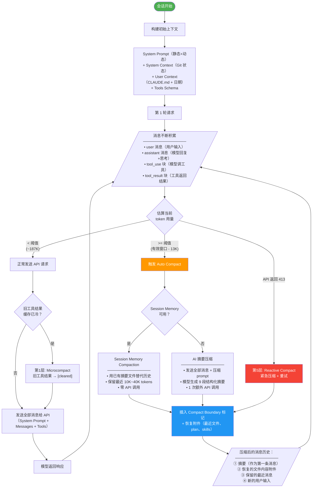
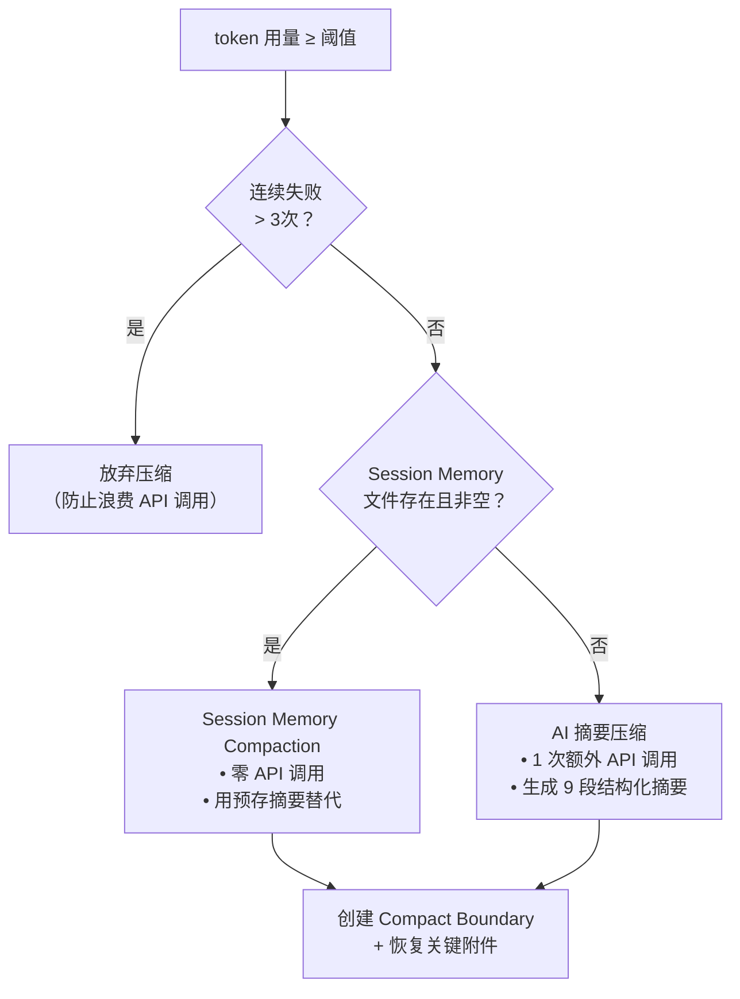

* 目录
{:toc}

---

> 基于 Claude Code 源码（`/Users/bytedance/code/claude`）分析

---

# 全局流程图

下面的 Mermaid 流程图展示了从会话开始到触发压缩再到压缩后继续工作的完整生命周期：



---

# 会话初始阶段：构建初始上下文

当用户启动一个新会话时，**不存在任何压缩**。此时发送给模型的完整上下文由以下四部分组成：

```
┌─────────────────────────────────────────────────────────────────┐
│                        API 请求结构                               │
├─────────────────────────────────────────────────────────────────┤
│  system: [System Prompt + System Context]                       │
│    ├── 静态部分（~3K tokens，全局缓存，跨会话复用）                   │
│    │     • 身份与安全（Intro）                                    │
│    │     • 系统约束（System）                                     │
│    │     • 工程任务规则（Doing tasks）                             │
│    │     • 谨慎操作规则（Executing actions with care）             │
│    │     • 工具使用规范（Using your tools）                        │
│    │     • 语气风格（Tone and style）                              │
│    │     • 输出效率（Output efficiency）                           │
│    │     ── DYNAMIC_BOUNDARY 标记 ──                              │
│    └── 动态部分（每次会话计算一次）                                  │
│          • Session-specific guidance                            │
│          • Memory（CLAUDE.md / MEMORY.md 加载结果）                │
│          • Env Info（CWD、OS、模型名、日期）                        │
│          • Language（用户语言偏好）                                │
│          • Output Style（用户自定义输出风格）                       │
│          • MCP Instructions（已连接的 MCP 服务器指令）               │
│          • FRC（Function Result Clearing 说明）                   │
│                                                                 │
│  messages: [User Context + 对话消息]                             │
│    ├── 第1条：&lt;system-reminder&gt; 注入 CLAUDE.md + 日期              │
│    ├── user: "用户的第一句话"                                     │
│    └── (此时只有1条消息，非常小)                                   │
│                                                                 │
│  tools: [工具 Schema 列表]                                       │
│    • Read, Write, Edit, Bash, Grep, Glob, Agent, ...            │
│    • 支持 defer_loading 延迟加载                                  │
│                                                                 │
│  thinking: { type: "enabled", budget_tokens: ... }              │
└─────────────────────────────────────────────────────────────────┘
```

## System Prompt 各部分规则

System Prompt 不是凭空写在内存里的字符串，而是由若干"section 函数"动态拼装而成。每段规则都对应一个出处：

### 静态部分（DYNAMIC_BOUNDARY 之前，可全局缓存）

> **这部分整体在做什么？** 这 7 条静态 section 合起来构成 Claude Code 的**"行为宪法"**——定义的是**模型是谁、能做什么、该怎么做**，而不是**具体任务是什么**。它们与具体项目/任务无关，对任何用户、任何会话都成立，因此被刻意放在 `DYNAMIC_BOUNDARY` 之前：① 可用 `scope: 'global'` 跨用户/会话缓存，省 token 省延迟；② 保证 Claude Code 行为一致、可预期；③ 与"会话特有"的动态内容（CLAUDE.md、Git 状态、当前任务）解耦。一句话：**静态内容是人格和行为准则，动态内容才是具体任务的上下文。**

下表按作用类别归类，列出每条 section 规定的内容（同一作用类别可能对应多条 section）。末列为默认外部交互式会话下的 token 预估（按文本量粗算，token ≈ 字符数 / 4，非精确计数）：

| 作用类别       | Section                     | 规定了什么                                                                                    | 预估 tokens |
| -------------- | --------------------------- | --------------------------------------------------------------------------------------------- | ----------- |
| **身份与边界** | Intro                       | 身份（软件工程 agent）、网络安全红线、URL 安全规则                                            | ~175        |
| **协作契约**   | System                      | 输出渲染、工具权限、`<system-reminder>` 语义、prompt injection 警示、Hooks 反馈、自动压缩声明 | ~350        |
| **协作契约**   | Executing actions with care | 不可逆/破坏性操作的确认规则、风险动作清单、根因优先于绕过                                     | ~475        |
| **工作方法论** | Doing tasks                 | 工程任务定位、避免过度设计、安全编码、不主动改动未读代码、`/help` 反馈渠道                    | ~700        |
| **工作方法论** | Using your tools            | 禁止用 Bash 替代专用工具、并行工具调用、TaskCreate/TodoWrite 推荐                             | ~225        |
| **沟通规范**   | Tone and style              | 不滥用 emoji、`file_path:line_number` 引用、`owner/repo#123` 引用、工具调用前不加冒号         | ~160        |
| **沟通规范**   | Output efficiency           | 直奔主题、简洁优先、避免铺垫和冗长解释                                                        | ~175        |
|                | **合计**                    |                                                                                               | **~2,260**  |

> **长度是否固定？** 对**同一构建 + 同一类用户 + 同一套工具**而言是固定的（这正是能用 `scope: 'global'` 缓存的前提）。但会随配置变化：内部用户（`USER_TYPE === 'ant'`）的 Doing tasks / Output efficiency 会多出若干子规则；启用的工具集影响 Using your tools 的插值；自定义 Output Style 可能裁掉 Doing tasks；REPL / 极简 / Proactive 模式走完全不同的精简 prompt。默认外部会话约 **2,000–2,500 tokens**，内部用户约 **3,000–3,500 tokens**（框图中 "~3K tokens" 即由此而来）。

> **这 7 条是否每次都在上下文里？** 是。它们是 system prompt 的固定前缀，默认交互式会话中**每次 API 请求都会携带**，且压缩机制（compact / microcompact）只作用于 `messages`，**永远不会动 system prompt 前缀**。由于位于 `DYNAMIC_BOUNDARY` 之前、内容不随会话变化，它们用 `scope: 'global'` 做跨会话缓存——结构上每次都带，但命中缓存后几乎零增量开销。
>
> 少数例外会改变这套前缀：极简模式（环境变量 `CLAUDE_CODE_SIMPLE`）整体替换为一句话；Proactive/KAIROS 模式走另一套 prompt；自定义 Output Style 且 `keepCodingInstructions !== true` 时会裁掉 "Doing tasks" 一条；Subagent 可能用各自的 system prompt 覆盖。

### 动态部分（DYNAMIC_BOUNDARY 之后，按会话/请求生成）

这部分内容**因会话而异**，分两类：一类是功能启用就有的"固定骨架文本"，一类是完全取决于用户数据、只能实测的"可变内容"。

| Section                                  | 内容                                                                                                   | 来源 / 取决于                   | 预估 tokens                         |
| ---------------------------------------- | ------------------------------------------------------------------------------------------------------ | ------------------------------- | ----------------------------------- |
| **Session-specific guidance**            | AskUserQuestion 用法、Shell `!<command>` 语法、Agent/Explore subagent 用法、`/<skill-name>` 调用规则等 | 随启用的工具与 feature 增减条目 | ~300–600                            |
| **Env Info**                             | 当前/附加工作目录、OS、平台、模型名、会话日期                                                          | 运行环境                        | ~100–200                            |
| **FRC（函数结果清理）**                  | 告知模型旧工具结果可能被替换为占位符                                                                   | 固定文本                        | ~100                                |
| **Summarize Tool Results**               | 工具结果过长时的自动摘要说明                                                                           | 固定文本                        | ~100                                |
| **Scratchpad Instructions**              | 启用 scratchpad 时告知可写暂存目录                                                                     | 启用时才有                      | ~50                                 |
| **Language**                             | "Always respond in `<language>`..."                                                                    | 用户语言偏好                    | ~30                                 |
| **Numeric length anchors**（仅内部用户） | 工具调用间 ≤25 词、最终回复 ≤100 词                                                                    | 内部用户才有                    | ~50                                 |
| **Memory（CLAUDE.md）**                  | 用户/项目级 CLAUDE.md、MEMORY.md 及递归加载的子记忆                                                    | **你写了多少算多少**            | 0 ~ 6K+（单入口上限 200 行 / 25KB） |
| **MCP Instructions**                     | 每个已连接 MCP 服务器声明的引导提示词（服务器作者写的，非 Claude Code 硬编码）                         | 连了哪些 MCP 服务器             | 0 ~ 数 K                            |
| **Output Style**                         | 自定义输出风格 prompt                                                                                  | 是否启用自定义风格              | 0 ~ 数百                            |
| **Token Budget**（feature flag）         | 用户指定 token 预算时的工作策略                                                                        | feature 启用时才有              | ~50                                 |

**估算公式**：

```
动态部分 ≈ 固定骨架 + Memory + MCP Instructions + Output Style

其中：
  固定骨架            ≈ 700 ~ 1,100        （会话内基本恒定）
  Memory(CLAUDE.md)   ≈ CLAUDE.md 字符数 / 4   （中文约 / 1.5~2）
  MCP Instructions    ≈ Σ(每个服务器 instructions 字符数 / 4)
                        ≈ N_mcp × ~100~500   （N_mcp = 已连接 MCP 服务器数，按每个经验区间）
  Output Style        ≈ 自定义风格文本字符数 / 4   （未启用则为 0）
```

**举例**（假设：CLAUDE.md 约 4,000 字符英文、连了 3 个 MCP 服务器、未启用自定义风格）：

```
固定骨架            ≈ 900
Memory              ≈ 4,000 / 4 = 1,000
MCP Instructions    ≈ 3 × 300 ≈ 900
Output Style        = 0
─────────────────────────────────
动态部分合计        ≈ 2,800 tokens
```

> 注：MCP 在两处各出现一次且内容不重复——`tools` 字段里是**可调用工具的 schema**，动态部分这里是 MCP 服务器提供的**引导提示词**。

### 静态/动态分界标记

system prompt 中间有一道分界线（`DYNAMIC_BOUNDARY`），作用是**把"不变的"和"会变的"分开，以便缓存**：

- **线之前**（静态 7 条）：对所有用户/会话都一样 → 可跨用户全局缓存，省 token 省延迟
- **线之后**（动态部分）：含 CLAUDE.md、环境、MCP 等会话特异信息 → 不能全局缓存

换句话说，这道线是缓存的"安全边界"：把稳定内容放前面尽量复用缓存，把易变内容放后面避免频繁打破缓存。

## System Context 与 User Context

System Prompt 之外，还有两块上下文。注意它们**不属于** system prompt 内部的"静态/动态 section"体系，注入位置也不同：

| 块                 | 内容                                                                                      | 注入位置 / 触发条件                                                               |
| ------------------ | ----------------------------------------------------------------------------------------- | --------------------------------------------------------------------------------- |
| **System Context** | Git 仓库状态：当前分支、主分支、`git status`（截断 2000 字符）、最近 5 次提交、Git 用户名 | **追加在 system prompt 末尾**；远程模式或禁用 git 指令时跳过                      |
| **User Context**   | CLAUDE.md 拼接结果 + 当前日期                                                             | **注入到 messages 第一条**，用 `<system-reminder>` 标签包裹（不在 system 字段里） |

> 来源区别：System Context 是 Claude Code **自动采集**的环境快照（跑 `git status`/`git log`）；User Context 里的 CLAUDE.md 才是**用户写的提示词**，日期由系统补上。

### Token 估算

**实测举例**（当前环境）：

| 块             | 实测                                          | 估算 tokens                  |
| -------------- | --------------------------------------------- | ---------------------------- |
| System Context | 当前 cwd 非 git 仓库                          | ~0（典型 git 仓库约 50~600） |
| User Context   | 用户级 `~/.claude/CLAUDE.md` 739 字符（中文） | ~370 + 日期 ~15 ≈ **~385**   |

> 即这两块通常合计在 **几百到上千 tokens** 量级：System Context 受 2000 字符上限约束、封顶 ~600；User Context 取决于 CLAUDE.md 写多长。

## Tools 列表

`tools` 是与 `system`、`messages` 平级的独立字段，并**不只是内置工具**。它由三大类工具汇总而成（统一经 `toolToAPISchema()` 序列化），其内容在会话内基本固定，压缩机制不会触碰它：

### 内置工具（写死在源码里）

随程序打包的固定工具，主要包括：Read、Write、Edit、Bash、Glob、Grep、Agent、AskUserQuestion、TodoWrite / TaskCreate、Sleep 等。

### Skill 工具（携带 skill 清单，非完整正文）

`Skill` 工具本身是内置工具，但它的 **description 里嵌入了所有可用 skill 的清单**（名字 + 一句话描述）。关键区别：

- **清单**（轻量，每个 skill 一两行）→ 进入 `Skill` 工具的描述，即会话开头看到的 `<available_skills>` 列表
- **某个 skill 的完整正文**（SKILL.md 内容）→ **不在 tools 里**，只有模型实际调用该 skill 时，才作为 `tool_result` 进入 `messages`

skill 来源**不是单一层级**，从多处汇总：

| 来源层级        | 目录                                        | loadedFrom |
| --------------- | ------------------------------------------- | ---------- |
| **用户级**      | `~/.claude/skills/`                         | `skills`   |
| **项目级**      | `<项目>/.claude/skills/`（向上递归到 home） | `skills`   |
| **系统/托管级** | `<managed>/.claude/skills/`                 | `skills`   |
| **内置打包**    | 随程序打包                                  | `bundled`  |
| **插件**        | 插件目录                                    | `plugin`   |

> 对照会话开头的 `<available_skills>`：`<location>user</location>` 即用户级，`<location>plugin</location>`（如 ecc: 系列）即插件级，`<location>builtin</location>`（如 traecli-doc）即内置级。

### MCP 工具（运行时动态注册）

MCP 工具不写死在代码里，而是**运行时连接 MCP 服务器后动态注册**。schema 存放在 `.mcp-tools/<namespace>/`，可声明 `defer_loading` 延迟加载以节省 prompt cache。MCP 服务器配置同样分**用户级 / 项目级 / 系统托管级**。

> 小结：Tools = 内置工具 + Skill 工具（携带多来源 skill 清单）+ MCP 工具（运行时注册）。skill 与 MCP 都**不是纯系统级**，均支持用户级、项目级与系统托管级。

### Tools 字段的 Token 预估

按文本量粗算（token ≈ 字符数 / 4，非精确计数）。**内置工具最确定**，Skill 清单随安装数量变化，MCP 随连接情况变化。

**内置工具（约 13K，较固定）**——其中 Bash 和 Agent 两个就占了近 ¾，因为它们的 description 里塞了大量使用规范：

| 工具                   | 预估 tokens |
| ---------------------- | ----------- |
| Bash                   | ~5,300      |
| Agent                  | ~4,200      |
| AskUserQuestion        | ~750        |
| FileRead               | ~750        |
| TaskCreate / TodoWrite | ~700        |
| FileEdit               | ~500        |
| Grep                   | ~350        |
| FileWrite              | ~300        |
| Glob                   | ~150        |
| Sleep / 其他           | ~150        |
| **内置合计**           | **~13,000** |

**Skill 清单（以 50 个 skill 估算）**——每个 skill 在清单里约 30–60 tokens（名字 + 一句话描述），取中值 ~45：

```
50 个 skill × ~45 tokens ≈ ~2,250 tokens
```

**MCP 工具**——每个工具约 200–500 tokens，取决于连接的服务器数量；`defer_loading` 的不全量计入。

**合计估算（内置 + 50 个 skill，未连 MCP）**：

| 部分               | 预估 tokens |
| ------------------ | ----------- |
| 内置工具           | ~13,000     |
| 50 个 skill 清单   | ~2,250      |
| **tools 字段合计** | **~15,000** |

> 即一个装了 50 个 skill 的典型配置，`tools` 字段约 **15K tokens**。若像本会话装了几百个 skill，光清单就可能达 15K–30K+，反而超过内置工具本身。该字段在会话内基本固定、参与 prompt cache，压缩机制不触碰它。

---

# 消息积累阶段：上下文不断增长

每一轮对话交互，都会在 messages 数组中增加以下内容：

```
一轮完整交互产生的消息：
┌────────────────────────────────────────────────────────┐
│ user message     │ 用户输入文本                         │
├──────────────────┼────────────────────────────────────┤
│ assistant message│ 模型的思考(thinking) + 文本回复       │
│                  │ + tool_use 块（调用工具的请求）        │
├──────────────────┼────────────────────────────────────┤
│ user message     │ tool_result 块（工具执行返回的结果）   │
│  (工具结果)       │ ← 这是 token 消耗的大户！            │
│                  │   • 文件读取：可能数百行代码            │
│                  │   • Bash 输出：可能大量日志            │
│                  │   • Grep 结果：可能几十个匹配          │
├──────────────────┼────────────────────────────────────┤
│ assistant message│ 模型继续回复或继续调用工具              │
│ ...              │ （可能连续多次 tool_use → tool_result）│
└────────────────────────────────────────────────────────┘
```

**单轮 token 量级（按场景）**：一轮的大小几乎**由工具结果决定**——不调工具就很轻，一旦读文件/跑命令就迅速变重：

| 场景 | 单轮约 | 构成 |
|------|--------|------|
| 纯问答（不调工具） | ~1K | user 输入(~50) + thinking(~500) + 文本回复(~300) |
| 读 1 个文件 | ~3–5K | 上面 + 1 次工具调用 + 中等文件读取(~2–3K) |
| 典型开发轮（多文件 + 命令） | ~20K+ | 读 3 个文件(~15K) + 几次 Bash/Grep(~3K) + 思考与回复(~3K) |

> 经验值：读一个 500 行代码文件 ≈ 3–5K tokens；Bash 跑测试输出几百行 ≈ 几千；Grep 命中几十处 ≈ 上千。所以工具结果（读文件、命令输出、搜索结果）才是单轮的主要变量，也是 microcompact 专门挑它清理的原因。

**Token 累积示例**（多轮累计总量）：

| 轮次    | 累积 tokens（估算） | 主要来源                               |
| ------- | ------------------- | -------------------------------------- |
| 第 1 轮 | ~5K                 | 用户提问 + 模型简单回复                |
| 第 2 轮 | ~25K                | 模型读取了 3 个文件（每个 ~5K tokens） |
| 第 3 轮 | ~60K                | 执行 Bash 命令 + Grep 搜索 + 文件编辑  |
| 第 5 轮 | ~120K               | 多轮工具调用，结果不断堆积             |
| 第 7 轮 | ~180K               | **逼近阈值 ~187K**                     |
| 第 8 轮 | **触发**            | **≥ 187K → Auto Compact**              |

**Token 估算方式**：
- 优先用 API 返回的真实 `usage` 值
- 新增消息用 ~4 字符/token 粗估（JSON 内容用 ~2 字符/token）

## 用 `/context` 查看实时占用

前面所有估算都可以用 `/context` 命令实测核对。它把当前上下文按类别画成方格图（每格代表一部分 token），并列出每类的占用。各类别含义：

| 类别 | 对应本文的哪块 | 说明 |
|------|---------------|------|
| **System prompt** | 第一部分 System Prompt（静态+动态） | 系统提示词 |
| **System tools** | 工具维度·内置工具 | 内置工具 schema；`(deferred)` 表示延迟加载未全量计入 |
| **MCP tools** | 工具维度·MCP | MCP 工具 schema；同样有 `(deferred)` |
| **Custom agents** | — | 自定义 subagent 定义 |
| **Memory files** | 用户维度·CLAUDE.md | CLAUDE.md / MEMORY.md |
| **Skills** | 工具维度·Skill 清单 | Skill 工具携带的清单 |
| **Messages** | 第二部分对话历史 | 累积的对话（**会增长的部分**） |
| **Autocompact buffer** | 阈值 buffer | 预留给压缩的空间（见第四部分） |
| **Free space** | — | 剩余可用空间 |

解读要点：

- **总窗口**：图顶部会标当前模型的窗口大小（默认 200K，开启后可达 1M）。
- **谁固定谁增长**：System prompt / System tools / MCP tools / Skills / Memory 这几类会话内基本不变（对应本文 ~19K 固定底座）；**只有 Messages 会持续涨**。
- **看 Messages 这一格**：它逼近 `Free space` 耗尽时，就接近压缩阈值——`Autocompact buffer` 那段就是系统刻意预留、不让用满的部分。
- **deferred 标记**：带 `(deferred)` 的工具是延迟加载的，没全量计入当前占用，实际调用时才补齐。

> 配套命令：`/model` 看当前模型、`/status` 看会话状态。不同发行版斜杠命令可能略有差异，可用 `coco -h` 确认本机支持哪些。

---

# 压缩前的轻量处理：Microcompact

> **先厘清"怎么压"**：压缩 Messages 有四种手段，本质分两类——**纯文本操作**（不调模型）和**模型生成摘要**（调模型）：
>
> | 机制 | 怎么压 | 操作粒度 | 用模型吗 | 删/留特征 |
> |------|--------|---------|---------|----------|
> | **Microcompact** | 工具结果内容 → 固定占位符 | 单条消息内的工具结果块 | ❌ 纯字符串替换 | 只清旧的工具结果，保留最近 N 个；消息条数不变 |
> | **Snip Compact** | 直接**删掉**中间消息片段 | 中间的整条消息 | ❌ 直接丢弃 | 删中段**可重建/低价值**的内容（如旧的读取/搜索结果），首尾保留；不生成摘要（实验性） |
> | **Context Collapse** | 用模型摘要**替换**若干消息 | 中间的整段消息 | ✅ 后台异步调模型 | 折叠中段，原文换成 `<collapsed>` 摘要占位（实验性） |
> | **Auto Compact** | 用模型生成 9 段摘要**替换**整批 | 边界前的所有消息 | ✅ 调模型（或复用 Session Memory 摘要） | 边界前整批 → 1 份结构化摘要，保留最近若干条 |
>
> 关键区别：占位符（Microcompact）和直接删（Snip）**不花 API 调用**；折叠成摘要（Context Collapse / Auto Compact）是**把多条消息喂给模型、让它写一份浓缩摘要替换原文**，要花一次额外调用（除非能复用已有的 Session Memory 摘要）。另有一条贯穿约束：无论删/折哪些消息，都**不能拆散 tool_use 与 tool_result 配对**，否则 API 报错。

在正式触发 Auto Compact **之前**，每次 API 请求都会先执行轻量处理：

## Microcompact（微压缩）

**触发条件**：距上次 assistant 响应超过阈值时间（缓存已冷）

**处理目标**：只针对 `COMPACTABLE_TOOLS` 这一组可压缩工具的结果：
- FileRead、Bash、Grep、Glob、WebSearch、WebFetch、FileEdit、FileWrite

**处理规则**：旧的工具结果内容被替换为固定占位符（模型已被 FRC 规则告知这一行为，见第一部分动态 section 中的 `getFunctionResultClearingSection`）：
```
Before:  tool_result = "第1行代码\n第2行代码\n...（500行文件内容）"
After:   tool_result = "[Old tool result content cleared]"
```

**保留策略**：保留最近 N 个工具结果不动，只清理更早的。

**效果**：在不需要额外 API 调用的情况下，显著减少 token 数。一个被清理的文件读取从 ~3000 tokens 降为 ~10 tokens。

---

# 触发压缩：阈值与决策

## 阈值计算

阈值由有效上下文窗口逐级扣减得到（取自 `autoCompact.ts` 中的 buffer 常量）：

```
上下文窗口 = 200,000 tokens（默认，可被 CLAUDE_CODE_MAX_CONTEXT_TOKENS 覆盖）
有效窗口   = 上下文窗口 - min(max_output_tokens, 20,000) = ~180,000
─────────────────────────────────────────────────────────
Auto Compact 阈值 = 有效窗口 - 13,000 (AUTOCOMPACT_BUFFER_TOKENS)
Warning  阈值     = 有效窗口 - 20,000 (WARNING_THRESHOLD_BUFFER_TOKENS)
Error    阈值     = 有效窗口 - 20,000 (ERROR_THRESHOLD_BUFFER_TOKENS)
阻塞限制          = 有效窗口 - 3,000  (MANUAL_COMPACT_BUFFER_TOKENS)
```

> 是否启用自动压缩由规则 `isAutoCompactEnabled()` 决定：环境变量 `DISABLE_COMPACT` / `DISABLE_AUTO_COMPACT` 或用户配置 `autoCompactEnabled=false` 都会关闭它（关闭后手动 `/compact` 仍可用）。连续失败超过 3 次（`MAX_CONSECUTIVE_AUTOCOMPACT_FAILURES`）后将放弃自动压缩，避免空耗 API 调用。

## 压缩决策流程



---

# 压缩内容：被压缩了什么？保留了什么？

## 被压缩的内容

压缩边界**之前**的所有消息都会被丢弃，包括：
- 所有早期的 user / assistant 消息
- 所有工具调用和结果（tool_use + tool_result）
- 模型的思考过程（thinking blocks）
- 中间的错误消息和重试消息

## 保留/恢复的内容

```
压缩后的消息历史（发送给下一轮 API）：
┌─────────────────────────────────────────────────────────────┐
│ ① 摘要消息（Compact Summary）                                │
│    • 9 段结构化摘要，涵盖：                                    │
│      - 用户意图、技术概念、文件变更                              │
│      - 错误修复、用户反馈、待办任务                              │
│      - 当前工作状态、下一步计划                                 │
│                                                             │
│ ② 恢复附件（Post-compact Attachments）                       │
│    • 最近读取的 5 个文件内容（50K token 预算，重新读取最新版）     │
│    • Plan 文件（如果在 plan mode 中）                          │
│    • 已调用的 skills 内容                                     │
│    • Deferred tools / MCP instructions delta                │
│    • SessionStart hooks 结果                                 │
│                                                             │
│ ③ 保留的最近消息                                              │
│    • Session Memory 模式：保留 10K~40K tokens 的最近消息        │
│    • 传统模式：摘要后不额外保留旧消息                            │
│                                                             │
│ ④ Compact Boundary 标记                                     │
│    • 标记位置，下次只从这里开始取消息                            │
└─────────────────────────────────────────────────────────────┘
```

## 失忆边界：哪部分一定会丢，什么条件下丢

压缩**不是清空**，而是"细节降级为摘要"。把压缩后那 ~40K messages 残留拆开，能清楚看到**哪些保住、哪些一定丢**：

| 内容 | 压缩后状态 | 记忆价值 |
|------|-----------|---------|
| 固定底座（System / 工具 / CLAUDE.md ~19K） | ✅ 永不压缩，原样 | CLAUDE.md 是**永久记忆**的唯一保险 |
| 最近若干轮对话（~20K） | ✅ 逐字原文保留 | 完整 |
| 正在操作的文件（~15K） | ✅ 重新读取最新版贴回 | 完整 |
| 用户意图 / 关键文件清单 / 待办 / 错误教训 | ⚠️ 摘要里保留**骨架** | 结构在，细节糊 |
| **早期对话的逐字内容、中间推理与试错过程** | ❌ **一定丢失**，只剩摘要痕迹 | 不可恢复 |

**"一定会失忆"的是哪部分？** 边界之前、且没被恢复附件捞回的所有逐字细节——具体包括：

- 早期每一轮的**原始措辞**（你当时具体怎么说的）
- 模型的**思考过程（thinking）和中间试错**（走过的弯路、被否掉的方案）
- 早期读过但**现在没在操作的文件内容**
- 大量工具结果的**原始输出**（日志、搜索命中详情）

这些被压成 9 段摘要里的几句话，**逐字层面不可恢复**。

**什么条件 / 多少轮之后开始丢？**（按 1M 窗口、重度写代码 ~20K/轮）

```
第 1 次失忆 = 首次 Auto Compact 触发时 ≈ 第 47 轮
此后每 ~45 轮一次，每次把"边界前那批"再压一层
```

- **第 47 轮之前**：零失忆，全部原文都在。
- **第 47 轮起每压一次**：边界前内容降级为摘要；且由于"摘要被卷进下一份摘要"（见第十节），**越早的内容被反复摘要、损失越重**——到后期只剩"摘要的摘要"。
- **任意时刻的清晰记忆窗口** ≈ 最近 0~45 轮原文（取决于距上次压缩多久）+ 更早内容的一份浓缩摘要。

**怎么对抗失忆**：凡是希望**永久不丢**的信息（项目约定、关键决策、长期任务），写进 **CLAUDE.md**——它属固定底座，每轮重发、从不被压缩；指望它留在对话历史里，迟早会被摘要掉。

---

# 压缩算法详解

## Session Memory Compaction（优先，零成本）

```
原始消息: [msg1, msg2, msg3, ..., msg50, msg51, ..., msg60]
                     ↓
Session Memory 文件已有摘要（后台持续更新），直接用作 summary
                     ↓
保留: [summary_msg, msg51, msg52, ..., msg60]  (最近 10K~40K tokens)
                     ↓
确保不拆分 tool_use/tool_result 对（adjustIndexToPreserveAPIInvariants）
```

**保留范围规则**（`DEFAULT_SM_COMPACT_CONFIG`，可被远程配置 `tengu_sm_compact_config` 覆盖）：

| 配置项                 | 默认值 | 含义                          |
| ---------------------- | ------ | ----------------------------- |
| `minTokens`            | 10,000 | 最少保留的 token 数           |
| `minTextBlockMessages` | 5      | 最少保留的含文本消息条数      |
| `maxTokens`            | 40,000 | 最多保留的 token 数（硬上限） |

## 传统 AI 摘要压缩（兜底）

**压缩 Prompt 的 9 段结构规则**（来自 `prompt.ts` 中的 `BASE_COMPACT_PROMPT`）。该 prompt 的开头还有一条硬规则 `NO_TOOLS_PREAMBLE`：要求模型**只输出文本、不得调用任何工具**，否则会浪费唯一的一次生成机会。

```
CRITICAL: Respond with TEXT ONLY. Do NOT call any tools.

Your task is to create a detailed summary of the conversation so far...

Before providing your final summary, wrap your analysis in <analysis> tags...

Your summary should include the following sections:
1. Primary Request and Intent
2. Key Technical Concepts
3. Files and Code Sections
4. Errors and fixes
5. Problem Solving
6. All user messages
7. Pending Tasks
8. Current Work
9. Optional Next Step
```

模型输出 `<analysis>` + `<summary>`，`<analysis>` 是草稿，被 `formatCompactSummary()` 剥离，最终只保留 `<summary>` 部分。

> 用户还可以通过 CLAUDE.md 中的 `## Compact Instructions` / `# Summary instructions` 追加自定义摘要要求，这些指令会被并入压缩 prompt（见 `BASE_COMPACT_PROMPT` 末尾的说明）。

**PTL 重试规则**：如果压缩请求本身太大触发 `prompt_too_long`，按 API round groups 从头部逐步丢弃最旧消息后重试，最多 `MAX_PTL_RETRIES` 次。

---

# 压缩后继续工作

压缩完成后，会话继续，此时的上下文结构变为：

```
┌─────────────────────────────────────────────────────────────────┐
│                   压缩后的第一次 API 请求                          │
├─────────────────────────────────────────────────────────────────┤
│  system: [System Prompt + System Context]  ← 不变               │
│                                                                 │
│  messages:                                                      │
│    ├── <system-reminder> CLAUDE.md + 日期                        │
│    ├── [Compact Summary]  ← 9段结构化摘要，承载历史"记忆"          │
│    ├── [恢复的文件内容]   ← 最近5个文件的最新内容                   │
│    ├── [Plan / Skills / MCP delta]  ← 恢复的工作状态              │
│    ├── [保留的最近消息]   ← 未被压缩的最近对话                     │
│    └── user: "用户的新输入"                                      │
│                                                                 │
│  tools: [工具 Schema 列表]  ← 不变                               │
└─────────────────────────────────────────────────────────────────┘
```

然后消息继续积累，当再次超过阈值时，**再次触发压缩**——这是一个循环过程。

---

# 多层防线总览

整个压缩体系是一套**渐进式降级**设计，按成本从低到高排列。其中实验性层级由 feature flag 控制开关：

| 层级 | 名称                   | 触发时机               | 算法              | API 成本 | 开关 / feature flag                          |
| ---- | ---------------------- | ---------------------- | ----------------- | -------- | -------------------------------------------- |
| 1    | Microcompact           | 每次请求前（缓存冷时） | 字符串替换        | 0        | 默认启用；缓存编辑模式 `CACHED_MICROCOMPACT` |
| 2    | Snip Compact           | microcompact 后        | 物理删除中间片段  | 0        | `HISTORY_SNIP`                               |
| 3    | Context Collapse       | 90% 容量时             | 投影式替换为摘要  | 0        | `CONTEXT_COLLAPSE`                           |
| 4a   | Session Memory Compact | 超过阈值               | 用预存摘要替代    | 0        | 远程配置 `tengu_sm_compact_config`           |
| 4b   | AI 摘要压缩            | 超过阈值（无 SM）      | LLM 生成 9 段摘要 | 1 次调用 | `isAutoCompactEnabled()`                     |
| 5    | Reactive Compact       | API 返回 413           | 同上 + 紧急重试   | 1 次调用 | `REACTIVE_COMPACT`                           |

---

# 会话能撑多久？（重度写代码场景推算）

把前面所有估算串起来，算一笔账：**一个长会话到底能跑多少轮，压缩后还能续多久，能不能开一个月。**

> 窗口口径：本推算按 **1M（100 万）上下文窗口**计算。当前最新的 Claude（Opus 4.6/4.7/4.8、Sonnet 4.6）已默认 1M 窗口、标准定价，市面常见模型（GLM、Gemini 等）也普遍到 1M 档。若用旧的 200K 窗口，把下面的阈值换成 ~167K 即可，轮数约为 1/5。

## 输入参数（全部取自前文估算）

| 量 | 取值 | 来源 |
|----|------|------|
| 上下文窗口 | **1,000,000** | 最新 Claude / 主流模型默认 1M |
| Auto Compact 阈值 | **~967K** | 有效窗口（1M − 20K 输出预留）− 13K buffer |
| 固定底座（每轮常驻、不被压缩） | **~19K** | System ~3.16K + 用户维度 ~0.4K + 工具维度 ~15.25K |
| 每轮新增（重度写代码） | **~20K** | 多文件 + 命令，第二部分单轮量级 |
| 压缩后 messages 残留 | **~40K** | 摘要 ~5K + 恢复附件（最近文件/plan/skills）~15K + 保留最近消息 ~20K |

## 第一阶段：首次压缩前能跑几轮

```
留给 messages 的空间 = 阈值 967K − 固定底座 19K = 948K
首次触发压缩 ≈ 948K ÷ 20K/轮 ≈ 47 轮
```

即重度写代码下，**大约第 47 轮**才触发第一次 Auto Compact。

## 第二阶段：每个压缩周期能续几轮

压缩后 messages 不是清零，而是残留 ~40K（摘要 + 恢复附件 + 最近消息）。所以之后每个周期可增长空间：

```
每周期可增长空间 = 阈值 967K − 固定底座 19K − 压缩残留 40K ≈ 908K
每个压缩周期 ≈ 908K ÷ 20K/轮 ≈ 45 轮
```

即首次压缩后，**每 ~45 轮才会再压一次**，进入稳定的"压缩—增长—再压缩"循环。

## 能长期持续吗？开一个月行不行

**能持续，且 1M 窗口下"记忆衰减"比 200K 时缓和得多。**

- **机制上不会满死**：每次逼近阈值就压缩，messages 被拉回 ~40K，再增长再压缩。这个循环没有次数上限——会话开一个月、跑上千轮，**技术上不会因为上下文满而中断**。这正是 system prompt 里那句"对话拥有无限上下文（unlimited context through automatic summarization）"的由来。
- **1M 下压缩频率很低**：每 ~45 轮才压一次，意味着绝大多数时间模型都持有**完整的近 40+ 轮原文**，几乎感觉不到压缩。相比 200K 时每 5 轮压一次，记忆连续性强很多。
- **代价仍是早期细节流失**：每次压缩把"边界前的几十轮"挤成一份 ~5K 摘要。跑足够久后，最早的对话只剩"摘要的摘要"，逐字细节、中间推理会丢——只是 1M 下这个过程慢得多。
- **稳定态有效记忆窗口**：任意时刻模型能"看清"的 ≈ **压缩残留 40K + 当前周期新增 ≤908K ≈ 最近 ~45 轮的完整内容 + 更早内容的摘要**。

## 总结

| 问题 | 答案（1M 窗口 / 重度写代码） |
|------|------|
| 首次压缩前能跑几轮？ | **~47 轮** |
| 之后每个压缩周期几轮？ | **~45 轮** |
| 能开一个月 / 上千轮吗？ | **能，会话不会因满而中断**——靠压缩循环维持 |
| 有什么代价？ | 早期对话被反复摘要、逐字细节流失，但 1M 下衰减缓慢，清晰记忆可覆盖最近 ~45 轮 |

> 一句话：**1M 窗口下，长会话"可持续且记忆衰减很慢"**。日常一天几十轮，基本一整天都碰不到一次压缩。但真正重要、希望永久不丢的信息，仍应写进 CLAUDE.md（属固定底座、永不被压缩），而不是指望它留在对话历史里。

---

# 关键设计思想

1. **Compact Boundary 是核心**：每次压缩后打一个边界标记，之后只发送边界后的消息。摘要承载了边界前所有历史的"记忆"。

2. **摘要即记忆**：压缩不是"丢弃"，而是"提炼"。9 段结构化模板确保关键信息（意图、代码、错误、进度）不丢失。

3. **渐进式降级**：先做零成本清理（微压缩）→ 免费摘要（Session Memory）→ 最后才用 AI 生成摘要。

4. **恢复机制**：压缩后主动恢复最近读取的文件内容（重新读取获取最新版本），确保模型不会"忘记"正在操作的代码。

5. **防漂移设计**：摘要的第 9 段要求包含"原文引用"，防止压缩后模型对任务理解发生漂移。

---
