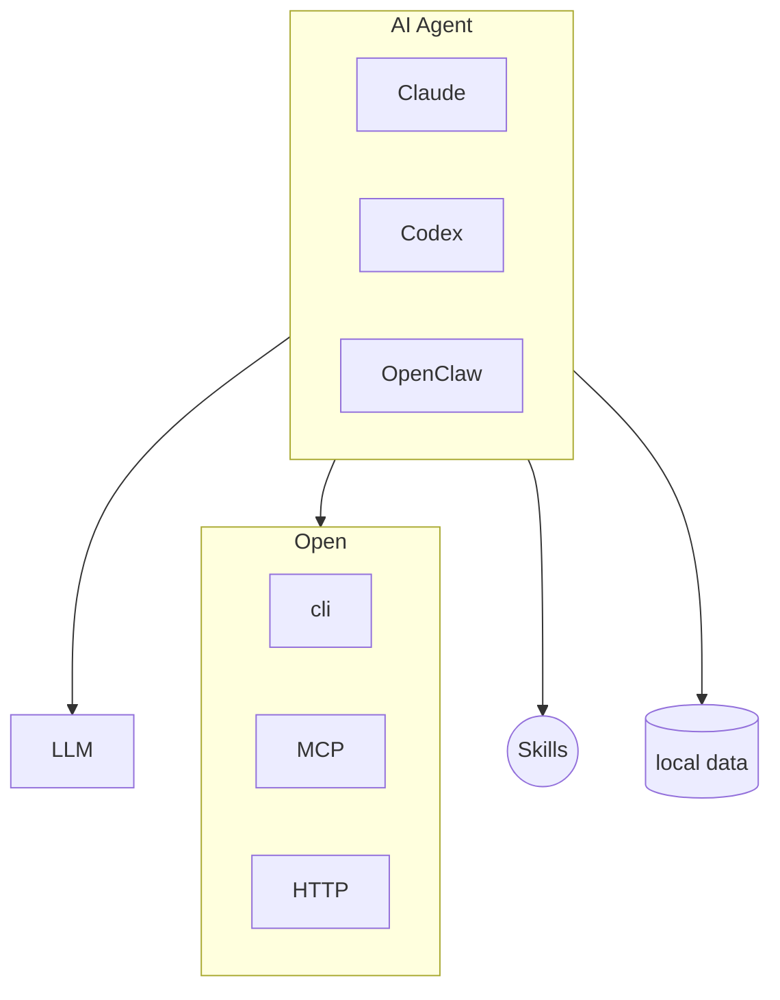

* 目录
{:toc}

---

# 人们对 AI 能力的认知存在巨大鸿沟

> 原文：[Karpathy on X](https://x.com/karpathy/status/2042334451611693415)

Karpathy 指出，对 AI 能力的认知存在巨大鸿沟，根源是两类使用者的脱节：

- **第一类（局外人）**：用过免费版或刷到 Advanced Voice 犯蠢视频，据此判断 AI 不过如此。但他们看到的并非 Codex、Claude Code 这类前沿模型的能力。
- **第二类（局内人）**：付费在编程、数学等强技术领域专业使用前沿模型，亲眼看到模型独立重构代码库、挖漏洞，最容易产生“AI 震撼”。

两类人评价的是**不同能力切片**：技术领域进步最猛，因奖励函数可验证（单元测试通过否）且 B2B 价值最高；写作、闲聊类提升平缓，难以训练、商业优先级低。所以“AI 没用”和“AI 改变一切”可以同时成立。

---

## AI 编程使用记录

| 工具 | 使用体验 |
|---|---|
| **豆包客户端 & DeepSeek 网页版** | 做了翻译页面、数独。每次都是把整个页面丢给他让他改，上下文长度太可怕了。代码很难一步到位，测试和调试也支持不了，只能自己干。 |
| **Trae** | 开发了 Android 应用——药不能停（因为不会写安卓），主要靠它实现，自己只做打包、翻译。现在不太好用了，经常排队。现在常用它看 diff，生成 Git message。 |
| **Kimi** | 买了 699 套餐，超出预期（本来对国产预期不高）。每天能用 1.5 亿 token，套餐额度两到三人使用没问题。Claude Code 和 Kimi 用起来差别不大。 |
| **GLM** | 官方套餐买不到，买了火山引擎。但火山对 GLM 5.1 计费系数大，一小时就能用完 5 小时额度。速度也不算快，在 Claude 中用经常报错，体验不好。 |
| **OpenCode** | 用起来不错，该有的都有，还免费支持 MiMO 2.5 和 DeepSeek V4 Flash。每个 BE 都能看到版本号和调试信息。 |
| **DeepSeek** | Pro 打了折但不算便宜，一天约 20 元。Flash 还行但没重度使用（因为用了 OpenCode 免费版）。之前火的 DeepSeek TUI 已改名 Reasonix。 |
| **Codex** | 要惊艳一些，体感老成，基本不会出错。用 ss 访问速度还不错。购买流程复杂，还得把 iPhone 捡起来。 |
| **Claude** | 模型 4.7 感觉不如 4.6，生态最好（基本大家按 Claude 标准设计），源代码已泄露可多研究。源码还是基于 system、user 提示词方式，创新在于引入 harness 理念和细致的提示词拆解（尤其跟 OpenClaw 相比），按需加载、上下文压缩都很专业。 |

## AI 绝不是仅用来编程，AI 编程只是一个垂直场景

23、24 年我看原来出来的时候，大家其实都是在做聊天工具，各种桌面应用，转折点在 24 年 Claude Code 横空出世，大家突然发现原来 LLM 写代码能做这么好。

## 架构层面的思考

> 在这里我还有一个观点：即使用 AI 编程，也不是仅仅修改原有代码，系统架构也要跟着调整。就像从单机应用→Web→分布式应用，一系列的技术变更都会带来技术框架、组件的变化，AI 也一样。

### 什么会新增？

涉及到人、交互的部分，有了 AI 的出现可以协助人完成一系列操作。就拿一个网站来说，之前需要一个人点击几个页面分析完数据后由人脑得出一个结论，未来会是一个 skill，由 AI 串联执行直接得到结果。

### 什么会保留？

基础功能、工具、数据接口。

### 什么会消失？

从第一点也能看出来，一些使用频率不高、对于时效性要求不高的场景都不需要做页面了（严重冲击前端）。

## 未来的架构形态

- **Agent Channel**：从页面、App 升级到各种交互工具：文本、图片、表格、语言、视频、审批流等等。例如飞书。
- **Agent 应用**：搭好基础架构，做好 Harness（未来还应有新的方案）、上下文压缩、插件化。
- **业务应用**：提供 Skill、Plugin；提供 CLI、OpenAPI、MCP。

架构变化也会导致产品形态变化。真正的竞争核心已不是“谁会聊天”，而是**“谁能把模型、工具、系统、入口和成本整合成可执行产品”**，尤其是部分之前是由人工完成的整合工作。

## 我们现在要做的

如何学习 AI？要去了解最新的技术、交一些学费。不光是为了用最好的模型，关键是要去了解最新的技术和趋势，这个在很多免费工具里是见不到的。AI 技术发展很快，避免掉队，更关键是避免用落后技术开发迭代造成时间浪费。需要调整一下。
