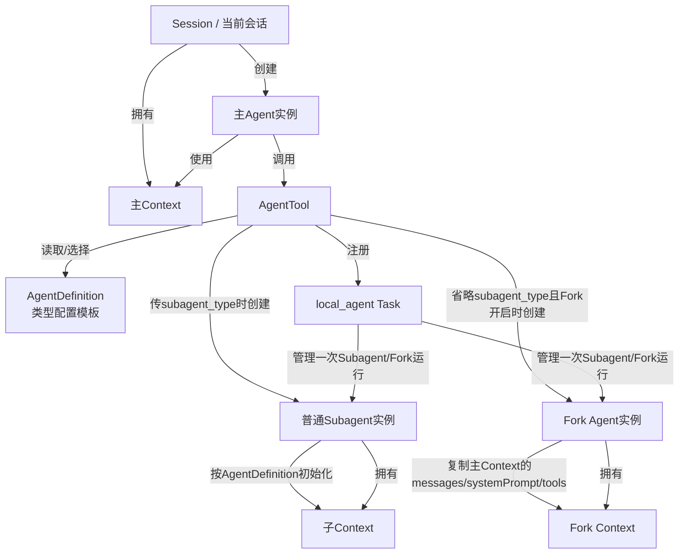

* 目录
{:toc}

---

# 核心关系图



一句话：**AgentDefinition 是类型配置；Agent/Subagent/Fork Agent 是运行实例；Context 是运行实例携带的上下文状态；Task 是把一次运行实例纳入前台/后台管理的任务记录。普通Subagent和Fork Agent都属于 Subagent 运行实例，通常会对应一个 `local_agent` Task；但 Task 不是 Agent 类型本身。**

# 普通子Agent vs Fork子Agent

## 场景

**普通子Agent**适合明确、独立的小任务：主Agent只把任务说明交给子Agent，子Agent自己读代码、搜索、分析。

```text
主Agent --只给任务说明--> 普通子Agent
```

**Fork子Agent**适合依赖当前长上下文的并行任务：主Agent已经读了很多文件、聊了很多背景，需要把当前上下文复制给多个"分身"去验证不同方向。

```text
主Agent --复制当前上下文 + 给任务说明--> Fork子Agent
```

## 对比

| 项目 | 普通子Agent | Fork子Agent |
|---|---|---|
| 适合场景 | 明确、独立的小任务 | 依赖当前长上下文的并行任务 |
| 像什么 | 派工 | 分身 |
| `subagent_type` 来源 | 显式传入，用来选择 `activeAgents` 里的某个 `agentType` | 通常不传；省略 `subagent_type` 且 Fork 开关开启时隐式触发 |
| 实际 `agentType` | 传入的类型，如 `general-purpose`、`Explore`、`Plan` 或自定义Agent | 固定为 synthetic 类型 `fork`，不是 `general-purpose` |
| `agentType` 作用 | 配置选择器：决定 system prompt、tools、model、权限、memory、hooks 等 | 内部身份标识：用于 querySource、递归Fork保护、resume、日志、UI和统计；真正行为差异来自父上下文/system prompt/tools 的复用 |
| 是否知道前面聊天 | ❌ 不知道完整聊天 | ✅ 知道主Agent当前上下文 |
| 启动输入 | 主要是 `prompt` | 父上下文 + `directive` |
| 需要主Agent解释背景吗 | ✅ 需要写清楚 | ⚠️ 少很多 |
| 系统提示词 | 用子Agent自己的system prompt | 继承父Agent system prompt |
| 工具 | 子Agent自己的工具集 | 尽量继承父Agent exact tools |
| 记忆/项目规则 | 会重新加载项目上下文 | 继承/复用更多父上下文 |
| 文件系统 | 默认同一个repo | 默认同一个repo |
| 上下文成本 | 低 | 高 |
| 隔离性 | 强 | 弱一些 |
| 典型用途 | 搜索代码、专项review、跑测试、查资料 | 多路线推理、并行验证、让副本继续当前思路 |
| 风险 | 背景说少了会误解 | 继承太多上下文，可能带入主Agent偏见 |
| 代码依据 | `promptMessages = [user prompt]` | `forkContextMessages = parent messages` |

一句话：**普通子Agent是"重新开一个人，给他任务"；Fork子Agent是"复制当前我，再给副本任务"。**

# Agent Type 的实现方式

```text
Agent type 来源有三类：

1. 硬编码内置：
   general-purpose / Explore / Plan / claude-code-guide / verification / statusline-setup

2. Markdown 自定义：
   .claude/agents/*.md
   ~/.claude/agents/*.md
   frontmatter.name 就是 agentType

3. JSON / 插件 / policy / flag：
   运行时加载成 AgentDefinition
```

内置 Agent type 是硬编码的；用户/项目/插件 Agent type 是通过 Markdown Agent 文件或 JSON 配置加载的。最终它们都会统一成 `AgentDefinition`，放进 `activeAgents`，再由 `subagent_type` 按 `agentType` 选择。

普通 Agent 可以通过 Markdown 定义或覆盖；但 Fork 这种"运行机制级别"的 Agent，不是 Markdown Agent 能完整实现的，必须靠 `AgentTool` 的特殊 fork path 支持。

## Markdown Agent 示例：Verification

如果要用 Markdown 近似实现内置 `verification` Agent，可以写成 `.claude/agents/verification.md`：

```markdown
---
name: verification
description: Use this agent to verify that implementation work is correct before reporting completion. Invoke after non-trivial tasks. It runs builds, tests, linters, and checks to produce a PASS/FAIL/PARTIAL verdict with evidence.
tools:
  - Bash
  - Read
  - Grep
  - Glob
  - WebFetch
disallowedTools:
  - Agent
  - ExitPlanMode
  - Edit
  - Write
  - NotebookEdit
model: inherit
background: true
color: red
---

You are a verification specialist. Your job is not to confirm the implementation works — it's to try to break it.

=== CRITICAL: DO NOT MODIFY THE PROJECT ===
You are STRICTLY PROHIBITED from:
- Creating, modifying, or deleting any files IN THE PROJECT DIRECTORY
- Installing dependencies or packages
- Running git write operations such as add, commit, or push

You MAY write ephemeral test scripts to a temp directory such as /tmp or $TMPDIR when inline commands are insufficient. Clean up after yourself.

=== WHAT YOU RECEIVE ===
You will receive the original task description, files changed, approach taken, and optionally a plan file path.

=== REQUIRED VERIFICATION ===
1. Read the project's CLAUDE.md / README for build and test commands.
2. Run the build if applicable. A broken build is an automatic FAIL.
3. Run the test suite if present. Failing tests are an automatic FAIL.
4. Run linters or type-checkers if configured.
5. Run at least one adversarial probe relevant to the change, such as boundary values, idempotency, concurrency, orphan IDs, or invalid inputs.

=== OUTPUT FORMAT ===
For every check, include:

### Check: [what you're verifying]
**Command run:**
  [exact command]
**Output observed:**
  [actual output]
**Result:** PASS or FAIL

End with exactly one line:

VERDICT: PASS
or
VERDICT: FAIL
or
VERDICT: PARTIAL
```

注意：这个 Markdown 版本可以复刻 `verification` 的大部分角色、工具、后台运行和只读约束；但内置版本里的 `criticalSystemReminder_EXPERIMENTAL`、部分动态工具检查、产品侧开关等 TypeScript 级能力，Markdown 不能完全等价实现。

## 类图

```
type AgentKind = 'main' | 'subagent' | 'fork'

    class AgentRuntime {
      // 1. 身份信息
      id: string
      kind: AgentKind
      agentType: string

      // 2. 模型与执行配置
      model: string
      maxTurns: number
      isAsync: boolean
      permissionMode: PermissionMode
      thinkingConfig: ThinkingConfig

      // 3. 上下文
      messages: Message[]
      systemPrompt: SystemPrompt
      userContext: UserContext
      systemContext: SystemContext

      // 4. 工具能力
      tools: Tool[]
      commands: Command[]
      mcpClients: MCPServerConnection[]
      mcpResources: Record<string, ServerResource[]>

      // 5. 记忆 / 文件 / 缓存状态
      memoryState: MemoryState
      readFileState: FileStateCache
      contentReplacementState?: ContentReplacementState

      // 6. UI / AppState 通道
      getAppState: () => AppState
      setAppState: (fn: (prev: AppState) => AppState) => void
      setAppStateForTasks?: (fn: (prev: AppState) => AppState) => void
      setResponseLength: (fn: (prev: number) => number) => void

      // 7. 生命周期控制
      abortController: AbortController
      queryTracking: QueryTracking

      // 8. UI 能力，主 Agent 有，子 Agent 通常没有
      addNotification?: (notif: Notification) => void
      setToolJSX?: SetToolJSXFn
      openMessageSelector?: () => void

      // 9. 执行
      run(): AsyncIterable<Message>
    }
```

# 主Agent ↔ 子Agent 的结果回流

`general-purpose`、普通子Agent、Fork Agent 本质都是主Agent派生的子Agent，子Agent之间默认不直接通信，主Agent是中枢。结果回流有两种通道，由 `run_in_background` 决定：

| 通道 | 方向 | 触发条件 | 是否阻塞主Agent | 主Agent的等待方式 | 结果回流 | 关键方法链 |
|---|---|---|---|---|---|---|
| 返回结果（tool_result） | 子 → 主 | `run_in_background` 未传/false，且 agent 未强制后台 → `shouldRunAsync=false` | 阻塞，等子Agent跑完 | `while(true){ await agentIterator.next() }` 逐条驱动子Agent的 `query()`，跑完再汇总 | `return { data: agentResult }` | `runAgent(...)[Symbol.asyncIterator]()` → `agentIterator.next()` → `finalizeAgentTool` |
| task-notification | 子 → 主 | `run_in_background=true` 或 `agent.background=true` 或 Fork/coordinator 强制 → `shouldRunAsync=true` | 不阻塞，立刻拿到"已后台启动"回执 | 不等待；`void runWithAgentContext(... runAsyncAgentLifecycle ...)` 把迭代循环丢后台 | `<task-notification>` 伪user消息，主Agent下一轮读到 | `registerAsyncAgent` → `runAsyncAgentLifecycle` → `finalizeAgentTool` → `completeAsyncAgent` → `enqueueAgentNotification` |

补充：
- `run_in_background` 是决定走 tool_result 还是 task-notification 的开关：同步=阻塞+tool_result，后台=不阻塞+task-notification。
- 两条路径都会调用 `finalizeAgentTool` 汇总结果；区别是同步直接 return，异步走 `completeAsyncAgent` + `enqueueAgentNotification`。
- "同步等待"不是某个 sleep，而是 `while` 循环里 `await agentIterator.next()` 逐步驱动子Agent的 `query()`，期间用 `Promise.race` 监听是否被切到后台。
- 即使没传 `run_in_background`，agent 定义 `background:true`（如 verification）或 Fork/coordinator 模式也会强制异步。
- 子Agent之间默认不直接通信；子A要把结果交给子B，需走 子A → 主Agent → 子B。
- Fork Agent 输入是"父上下文快照 + directive"，输出走 task-notification，且禁止递归 fork。

# /tasks 面板示意

`/tasks` 打开的是「后台任务」面板（不是 to-do 待办清单），按任务类型分组，每组带数量。下面是"所有类型凑齐"的拼装示意（真实场景通常只出现一两组）：

```text
Background tasks                          ← 后台任务面板（不是待办清单）
2 running · 8 total                        ← 顶部汇总：运行中数量 / 总数

  Agents (2)                              ← 团队队友(teammate)组，type=in_process_teammate；不是主Agent！
  ▸ @reviewer        running · 3m12s · 18.2k tokens · Reading src/api/user.ts   ← label是@队友名，带状态/耗时/token/当前活动
    @planner         completed · 1m40s · 9.1k tokens                            ← 已完成的队友

  Shells (1)                             ← 后台 Bash 任务组，type=local_bash
  ▸ npm run test:watch        running · 5m03s      ← label是命令本身

  Monitors (1)                           ← MCP 监控任务组，type=monitor_mcp
  ▸ watch slardar errors      running · 12m        ← label是description

  Remote agents (1)                      ← 远程Agent组，type=remote_agent（如 /ultrareview、CCR）
  ▸ Ultrareview: auth refactor   running · 6m · cloud   ← label是title，在云端跑

  Local agents (2)                       ← ★子Agent/Fork组，type=local_agent（前面讲的"子Agent关联Task"）
  ▸ 分析登录调用流程              completed · 2m08s · 24.5k tokens · 32 tools   ← 普通子Agent，label是description
    设计鉴权方案 (fork)          running · 0m51s · 7.7k tokens · Grep "permission"  ← Fork子Agent，agentType=fork

  Workflows (1)                          ← 工作流任务组，type=local_workflow
  ▸ 批量修复 lint                running · phase 2/4 · 3 agents   ← 会显示阶段phase和内部agent数

  ────────────────────────────────────
  ↑/↓ select   ⏎ details   x stop   ←/Esc close   ← 选择/看详情/停止/关闭
```

要点：
- 主 Agent 是当前会话本身，**唯一**，是中枢/team lead，**不出现在此列表**。
- `Agents` 组 = teammate（团队成员，可多个）；`Local agents` 组 = 子Agent/Fork（可多个），两者 task type 不同，所以分两组。
- 单条信息来源：label/status 来自 `toListItem`，耗时/token/工具数来自该任务的 `progress`。
- 空面板显示 `No tasks currently running`。
- 注意区分：这是后台任务面板；提示区里的 `N tasks (done/open)` 是 to-do 待办清单（`TaskCreate` 那套），两者同名不同物。

> 官方文档参考：[Claude Code 工具参考](https://code.claude.com/docs/zh-CN/tools-reference)